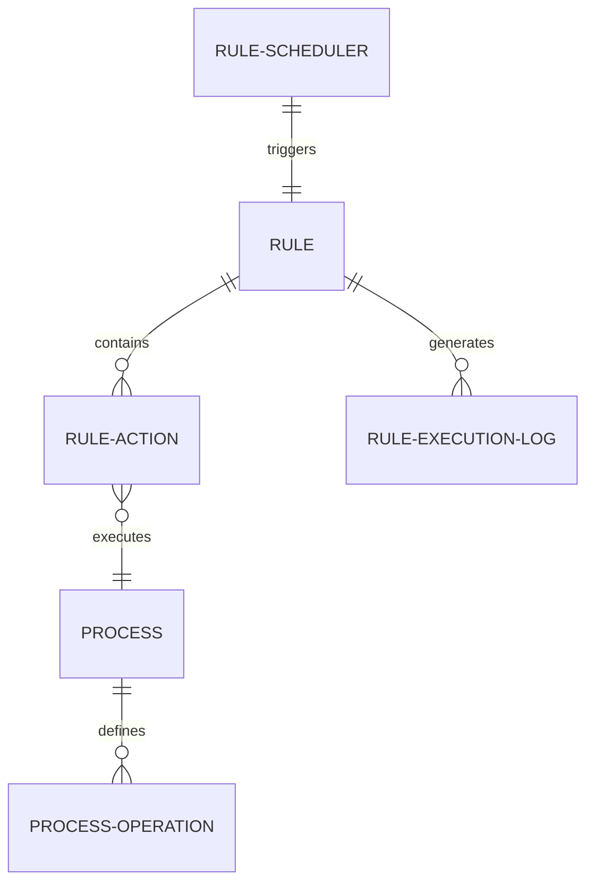

# DocType Reference

Keywords: doctype, schema, metadata, rule, process, log, scheduler

## Audience

- Administrators
- Developers
- Contributors

## Overview

FlexiRule uses a structured set of DocTypes to manage rule definitions, visual metadata, reusable logic, and execution audit trails. This reference provides a breakdown of the primary DocTypes and their key fields.

---

## Visual Schema

---

## 1. Rule
The primary container for an automation flow. It defines **when** logic starts and **what** it aims to achieve.

### When to Use
- Use this as the main entry point for any automation logic in FlexiRule.

| Field | Type | Description |
| :--- | :--- | :--- |
| `rule_name` | Data | Unique identifier of the rule. |
| `trigger_type` | Select | `DocType Event`, `Scheduler Event`, or `Callable Event`. |
| `document_type` | Link | The target DocType this rule monitors. |
| `status` | Select | Lifecycle state: `Draft`, `Active`, `Disabled`, etc. |

---

## 2. Rule Action
Represents a single executable node (Step) within a Rule's graph.

### When to Use
- Rule Actions are managed via the [Rule Builder](), which handles the creation of these child records automatically.

| Field | Type | Description |
| :--- | :--- | :--- |
| `action_type` | Select | Category: `Condition`, `Process`, `Loop`, `Assignment`, etc. |
| `on_error` | Select | Policy: `Stop`, `Continue`, `Retry`, `Rollback`. |
| `next_step_if_true` | Data | Node ID to execute on success. |

---

## 3. Process
Defines a file-backed logic module that can be extended via custom Python code.

### When to Use
- Use this to register custom Python modules that provide specific "Operations" to the Rule Builder.

| Field | Type | Description |
| :--- | :--- | :--- |
| `process_name` | Data | Unique identifier for the process. |
| `is_standard` | Select | If `Yes`, code is synced to the app's directory. |

---

## 4. Rule Execution Log
Audit trail for every rule execution.

### When to Use
- Use this to debug rule execution, view path traces, and inspect variable states at runtime.

| Field | Type | Description |
| :--- | :--- | :--- |
| `status` | Select | `Success`, `Failed`, or `Stopped`. |
| `execution_path` | Code | JSON trace of nodes and results. |
| `context_snapshot` | Code | JSON dump of variables (`vars`). |

---

## Related Topics

- [Execution Engine]()
- [Rule Builder]()
- [API Reference]()
