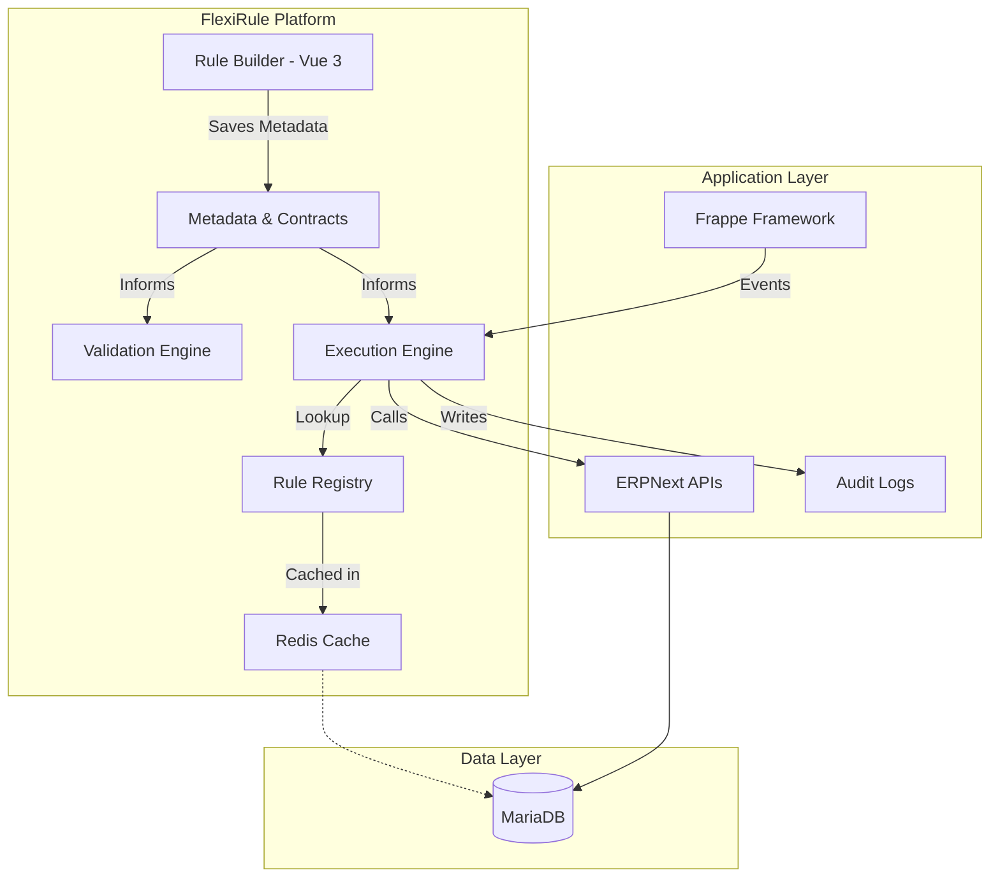

# High-level Architecture

FlexiRule is built around a **contract-driven, metadata-first architecture**. Rather than hard-coding automation into scattered Python modules, business logic is represented as structured metadata. The visual designer, validation engine, and runtime executor all consume the same centralized contracts, ensuring the system remains consistent, extensible, and high-performance.

---

## System Overview

FlexiRule sits as an orchestration layer on top of the Frappe Framework, coordinating how events from ERPNext are transformed into executable business logic.



---

## Architectural Philosophy

The core design of FlexiRule is guided by the principle of **Separation of Concerns**. We distinguish between the *definition* of logic (Design Time) and the *execution* of logic (Runtime), using Technical Contracts as the bridge between them.

### 1. Registry & Contracts: The Single Source of Truth
This is the most critical subsystem in FlexiRule. Every Action Type (e.g., "Send Email" or "Query Records") publishes a **Technical Contract** that defines:
- **Configuration Schema**: What fields are needed in the UI.
- **Validation Rules**: What constitutes a "valid" block.
- **Runtime Behavior**: The specific Python logic to execute.
- **Input/Output Mapping**: How data enters and leaves the block.

**Why this matters:** Because every subsystem consumes the same contract, adding a new Action Type automatically makes it available to the Rule Builder, validation engine, and runtime executor without modifying the core engine.

### 2. Rule Builder: Metadata-Driven Designer
The Rule Builder is more than just a drag-and-drop canvas. It is a **Contract-Driven Designer** that:
- Dynamically generates configuration forms based on Action Contracts.
- Provides real-time validation feedback as you connect blocks.
- Manages the visual graph and technical metadata simultaneously.
- Allows for property inspection and deep configuration of every node.

### 3. Backend Engine: The Orchestrator
The Python-based engine is the heart of the system. It is responsible for:
- **Rule Discovery**: Finding the right rules for the right event via the Registry.
- **Context Lifecycle**: Managing the state of `doc` and `vars` during a run.
- **Orchestration**: Walking the execution plan and handling branching logic.
- **Safety**: Managing transactions, error handling, and timeout protection.
- **Integration**: Serving as the boundary between FlexiRule and Frappe/ERPNext APIs.

---

## Design-Time vs. Runtime

FlexiRule maintains a strict boundary between designing and running rules to ensure production stability and performance.

| Phase | Responsibilities | Output |
| :--- | :--- | :--- |
| **Design Time** | Visual Building, Integrity Validation, Condition Compilation, Registry Indexing. | A **Compiled Execution Plan** and high-speed cache entries. |
| **Runtime** | Event Interception, Registry Lookup, Context Initialization, Plan Execution, Async Logging. | **State Mutation** (Document updates) and a permanent **Audit Trail**. |

---

## Extension Architecture

FlexiRule is designed to be plug-and-play. Developers can extend the platform by creating new "Logic Blocks" without touching the core engine code.

```text
Developer writes Python Class
      │
      ▼
Publishes a Contract (JSON/Python)
      │
      ▼
Automatically available to:
 ├── Rule Builder (Dynamic Config Form)
 ├── Validation Engine (Sanity Checks)
 ├── Execution Engine (Runtime Logic)
 └── Documentation (Auto-generated help)
```

---

## Integration Boundaries

FlexiRule orchestrates ERPNext; it does not replace its fundamental framework.
- **Inbound**: FlexiRule intercepts standard DocType events (Before Save, On Submit, etc.).
- **Outbound**: FlexiRule performs actions by calling standard Frappe/ERPNext APIs and methods.
- **Data**: All rule definitions, logs, and configurations are stored as standard Frappe DocTypes.

---

## Architectural Principles

- **Metadata over Hard-coding**: Represent logic as data that can be versioned and audited.
- **Contracts as the Authority**: Ensure consistency across UI, Validation, and Runtime.
- **Preparation over Interpretation**: Perform heavy lifting during Save to keep Execution lightweight.
- **Registry-based Discovery**: Decouple rule triggers from application code for better scalability.
- **Extensibility without Modification**: Allow the platform to grow through modular Action Types.
