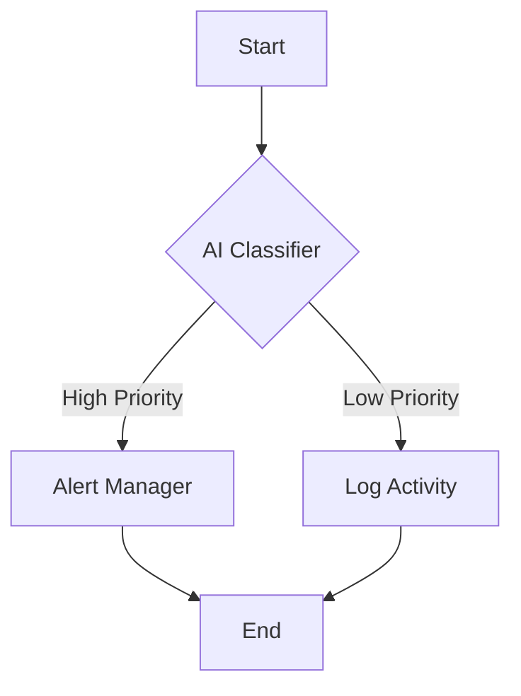
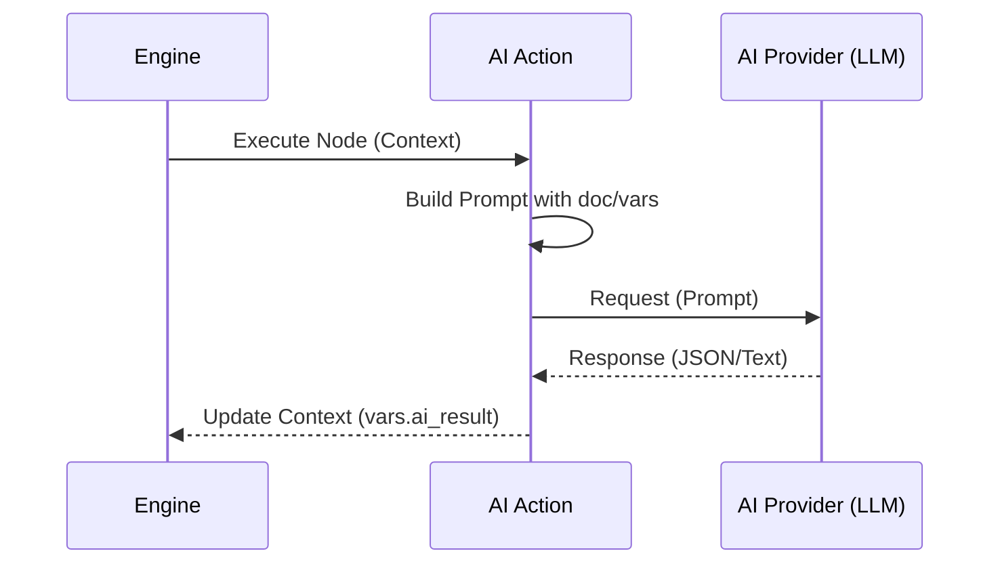

# AI Features

Keywords: AI, machine learning, prompt engineering, automation, intelligent rules

## Audience

- End Users
- Developers

---

## Overview

FlexiRule integrates AI capabilities directly into the visual orchestration layer, allowing for "intelligent" business processes that can analyze text, make predictions, or generate content as part of a rule execution.

### When to Use
- Use AI Features when you need to handle unstructured data (e.g., sentiment analysis of comments).
- Use AI for complex decision-making that is difficult to express in traditional boolean logic.
- Use AI for automated content generation based on document state.

### Do Not Use
- Do not use AI for deterministic logic where a simple condition or math formula suffices.
- Do not use AI for high-volume, low-latency requirements without considering cost and performance.

---

## Visual Example

---

## Capabilities

### 1. Context-Aware Prompting
AI Actions can ingest the entire execution context (`doc`, `vars`) to generate responses tailored to the specific record state.

### 2. Natural Language Classification
Classify documents or inputs into predefined categories without writing complex regex or lookup tables.

### 3. Data Extraction
Extract structured information from unstructured text fields and map them to document fields or variables.

---

## AI Integration Flow

---

## Prompt Best Practices

- **Be Specific**: Provide clear instructions and examples (few-shot prompting) within the action configuration.
- **Limit Output**: Request the AI to return data in a specific format (e.g., JSON) for easier parsing by subsequent nodes.
- **Security**: Be mindful of PII (Personally Identifiable Information) when sending data to external AI providers.

---

## Limitations & Considerations

- **Latency**: AI requests are network-bound and can introduce delays in rule execution.
- **Cost**: Each AI execution incurs a cost based on the provider's token usage.
- **Hallucinations**: AI outputs should be validated, especially when performing critical mutations.

---

## Related Topics

- [Execution Engine]()
- [Variables]()
- [Condition Builder]()
