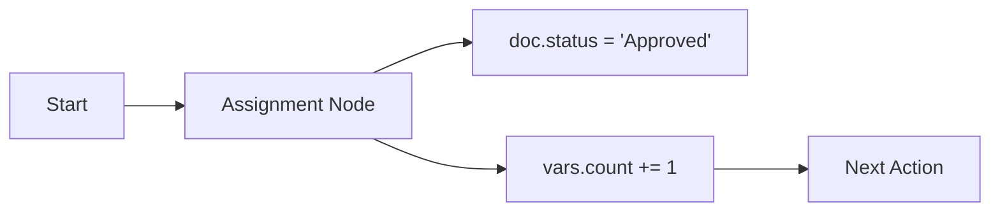

# Assignment Action

Keywords: assignment, assignment, variables, mutation, state change

## Audience

- End Users
- Developers

## Overview

The **Assignment** action is a powerful tool for performing batch state mutations on the current document or context variables. It replaces the legacy **Assignment** action with a more robust system that supports multiple operators and sequential execution.

### When to Use
- Use this when you need to update fields on the current document (e.g., `doc.status = "Completed"`).
- Use this to store temporary data in `vars` for use later in the rule.
- Use this for basic mathematical transformations or list operations.

### Do Not Use
- Do not use this to create *new* documents (use [Document Action]() instead).
- Do not use this for complex business logic that requires database lookups or external API calls (use [Process]() instead).

---

## Visual Example

---

## Configuration

### Value Editors

The Assignment action provides two modes for defining values:

#### 1. Formula Resolver
A "no-code" interface for common operations:
- **Date Math**: `Today + 5 Days`.
- **Numeric Calculations**: Arithmetic between fields or constants.
- **Aggregations**: `SUM`, `AVG`, or `COUNT` of child table rows.

#### 2. Template Editor
A rich-text interface for:
- **Jinja Templates**: Dynamic strings with full access to the execution context.
- **Variable Insertion**: Easily pick fields from `doc` or `vars`.

---

## Operators

| Operator | Description | Supported Types |
| :--- | :--- | :--- |
| **Assignment** | Replaces the target with a new value. | All |
| **Clear** | Resets the target to its default empty state. | All |
| **Increment By** | Adds a numeric value to the target. | Numeric |
| **Append To List** | Adds an item to the end of a list. | Tables, Lists |
| **Toggle Boolean** | Flips a boolean value (1 to 0, 0 to 1). | Check |

---

## Examples

### Basic Example
**Problem**: Mark an Invoice as "Paid" once a payment is confirmed.
**Configuration**:
- Target: `doc.status`
- Operator: `Assignment`
- Value: `Paid`
**Execution**: The engine updates the status field on the document.
**Result**: The document reflects the updated status.

### Real-world Example
**Problem**: Track the number of high-value items in an order.
**Configuration**:
- Target: `vars.high_value_count`
- Operator: `Increment By`
- Value: `1`
- **Run If**: `item.price > 1000` (within a loop)
**Execution**: Increments the variable each time an item meets the condition.
**Result**: `vars.high_value_count` contains the final tally.

### Advanced Example
**Problem**: Calculate a custom expiry date based on a document's posting date and a customer category.
**Configuration**:
- Target: `doc.expiry_date`
- Operator: `Assignment`
- Value (Formula): `doc.posting_date + 30 Days`
**Execution**: The Formula Resolver calculates the date.
**Result**: `doc.expiry_date` is set to 30 days after `posting_date`.

---

## Common Mistakes

- **Circular Assignments**: Setting `doc.total = doc.total + 10` in a rule that triggers on "Total Change" (can cause loops).
- **Type Mismatches**: Trying to `Increment` a string field.
- **Save Hooks**: Forgetting that `doc.*` mutations might not be saved if the rule is triggered in a read-only event (like `after_save`).

---

## Related Topics

- [Variables Reference]()
- [Formula Resolver]()
- [Execution Lifecycle]()
