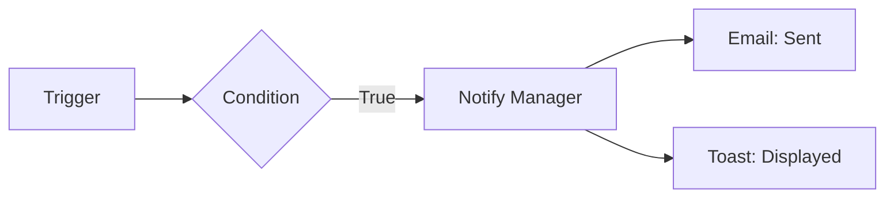

# Notify Action

Keywords: notify, email, alert, message, toast, communication

## Audience

- End Users
- Administrators

## Overview

The **Notify** action sends alerts and communications to users or external systems. It bridges the gap between rule logic and human intervention by keeping stakeholders informed about process milestones or required actions.

### When to Use
- Use this to alert a user when a document requires their attention (e.g., "Pending Approval").
- Use this to send automated emails to customers (e.g., "Order Confirmed").
- Use this for real-time feedback in the UI using Toast notifications.

### Do Not Use
- Do not use this for critical data mutation logic (use [Assignment]() or [Process]() instead).
- Do not use this for high-frequency internal logging (use a custom [Process]() or the built-in Rule Logs).

---

## Visual Example

---

## Configuration

### Notification Channels

- **Toast**: A temporary browser notification that appears in the Frappe UI.
- **System Notification**: A permanent entry in the user's notification log.
- **Email**: Sends an email via Frappe's email queue.
- **External Provider**: Dispatches a notification through a custom registered provider (e.g., SMS, Slack).

### Content Generation
All fields (Subject, Message, Recipients) support **Jinja templates**, allowing for highly personalized and data-driven notifications.

---

## Examples

### Basic Example
**Problem**: Notify the current user when a background task finishes.
**Configuration**:
- Channel: `Toast`
- Message: `Processing complete for {{ doc.name }}`
**Execution**: The engine renders the template and sends the message to the user's active session.
**Result**: A popup appears in the corner of the user's screen.

### Real-world Example
**Problem**: Send an approval request email to a Department Head.
**Configuration**:
- Channel: `Email`
- Recipients: `{{ doc.department_head_email }}`
- Subject: `Approval Required: {{ doc.doctype }} {{ doc.name }}`
- Message: `Please review the document here: {{ frappe.utils.get_url_to_form(doc.doctype, doc.name) }}`
**Execution**: The engine resolves the department head's email and generates the form URL.
**Result**: An email is queued in the system for delivery.

---

## Common Mistakes

- **Incorrect Recipient Paths**: Using a field that doesn't contain a valid email address.
- **Template Errors**: Syntax errors in Jinja (e.g., missing closing braces `}}`).
- **Notification Fatigue**: Sending too many notifications for trivial events, causing users to ignore them.

---

## Related Topics

- [Assignment Action]()
- [Jinja Templating Reference](https://jinja.palletsprojects.com/)
- [Rule Logs]()
