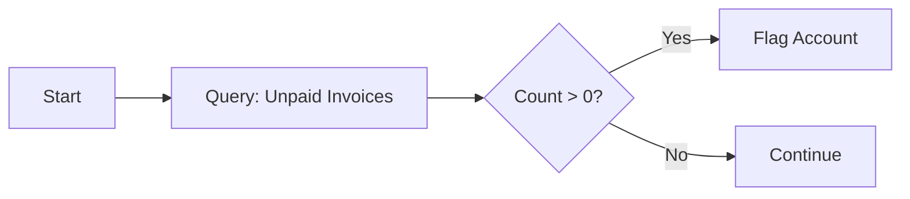

# Query Records Action

Keywords: query, database, select, aggregation, lookup, search

## Audience

- End Users
- Developers

## Overview

The **Query Records** action retrieves data from any DocType in the system. It allows rules to "look outside" the triggering document to fetch related information, verify existence, or perform calculations across many records.

### When to Use
- Use this when you need to fetch data from a related document (e.g., getting the Customer's credit limit).
- Use this to check if a specific record exists before proceeding.
- Use this to calculate totals or averages across multiple records (e.g., "Sum of all unpaid invoices for this customer").

### Do Not Use
- Do not use this if the data is already available on the current `doc` or its child tables.
- Do not use this for extremely complex SQL joins (consider a [Process]() action with a custom SQL query instead).

---

## Visual Example

---

## Configuration

### Query Modes

- **Query List**: Returns a list of records matching the filters.
- **Query Doc**: Returns a single record by name or ID.
- **Exist Record**: Returns `True` or `False` based on whether matching records exist.
- **Aggregate Operations**: `Count`, `Sum`, `Average`, `Min`, `Max`.
- **Group By**: Returns aggregated results grouped by a specific field.

### Decision Tree: Which Query Mode to Choose?

Need to check if data exists?
├── Yes → **Exist Record**
└── No
    Need a specific field from one record?
    ├── Yes → **Query Doc**
    └── No
        Need to process multiple records?
        ├── Yes → **Query List**
        └── No → **Aggregate Operations** (Sum, Count, etc.)

---

## Examples

### Basic Example
**Problem**: Check if a Customer exists before creating a new project.
**Configuration**:
- Mode: `Exist Record`
- DocType: `Customer`
- Filters: `name == doc.customer`
- Mutation: `Set Context Variable` (target: `vars.customer_exists`)
**Execution**: The engine executes a `SELECT` query with a `LIMIT 1`.
**Result**: `vars.customer_exists` is `True` if found.

### Real-world Example
**Problem**: Prevent a Sales Order from being submitted if the customer has more than 5 overdue invoices.
**Configuration**:
- Mode: `Count`
- DocType: `Sales Invoice`
- Filters:
    - `customer == doc.customer`
    - `AND`
    - `status == "Overdue"`
- Mutation: `Set Context Variable` (target: `vars.overdue_count`)
**Execution**: The engine runs a `COUNT` query on the Sales Invoice table.
**Result**: `vars.overdue_count` is compared in a subsequent [Condition]() node.

---

## Common Mistakes

- **Unfiltered Queries**: Forgetting to add filters, which can cause the engine to try and fetch thousands of records (use `LIMIT` in the query configuration).
- **Type Mismatch in Filters**: Passing a name string where an ID is expected or vice versa.
- **Performance**: Running high-frequency queries on large tables without proper indexing on the filtered fields.

---

## Related Topics

- [Filter Group UI]()
- [Loop Action]()
- [Condition Action]()
