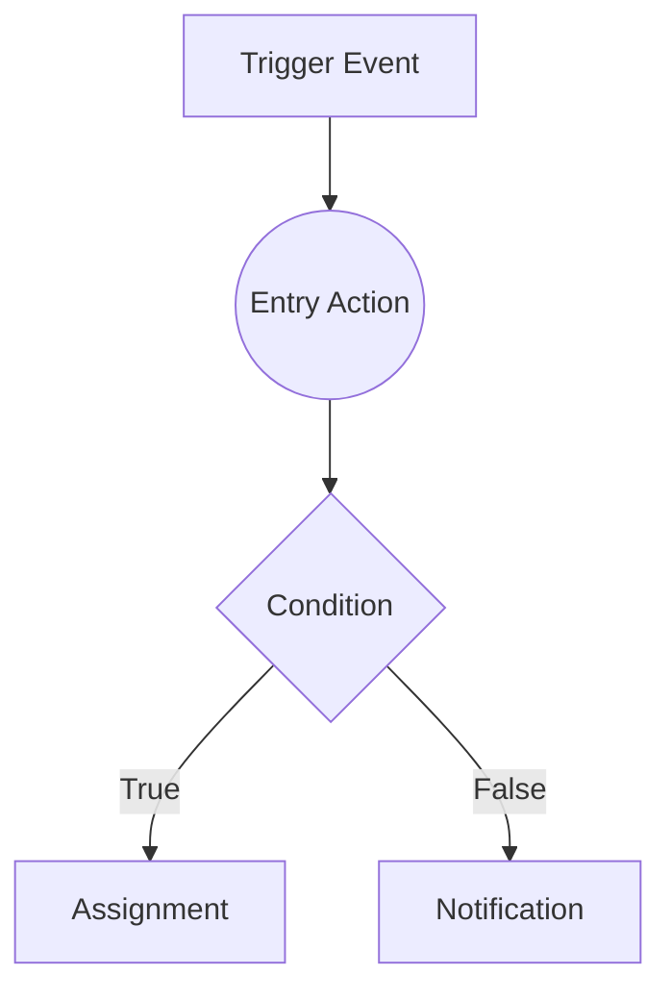

# Entry Action

Keywords: [start, trigger, root, entry, initialization, workflow start]

## Overview
The **Entry Action** is the mandatory starting point of every FlexiRule flow. It represents the transition from the external trigger (such as a DocType event or a Schedule) into the rule's logic graph.

While it is technically an action, it acts as a structural anchor that initializes the **Execution Context**, making the triggering document (`doc`) and temporary variables (`vars`) available to all downstream nodes.


The Entry Action is not a business action. It exists to bridge a FlexiRule trigger and the execution graph, ensuring that all downstream actions receive a consistent execution context.


## Why FlexiRule Uses an Entry Action
FlexiRule represents rule execution as a graph. Every graph requires a deterministic starting node. The Entry Action provides that starting point and guarantees a consistent execution context regardless of whether execution was initiated by a document event, scheduler, API call, or another trigger source.

## When To Use
- **Every Rule**: Every active rule must have exactly one Entry Action.
- **Starting Logic**: Use it as the first node to define where your business logic begins.
- **Trigger Visualization**: Use it to see at a glance which event initiated the rule.

---

## Execution Position
The Entry Action **always executes first**. No action can run before the Entry Action. All execution paths originate from the Entry Action and ultimately trace back to the rule trigger.

---

## Relationship to Triggers
The Entry Action does not define *when* a rule runs. Trigger configuration determines:
- When execution begins.
- What context is supplied.
- Which document is loaded.

The Entry Action simply represents that trigger inside the rule graph.

---

## Configuration
The Entry Action is unique because its configuration is inherited from the **Rule Header**. It cannot be deleted or manually added; it is automatically generated when a new rule is created.

| Property | Description |
| :--- | :--- |
| **Label** | Usually set to "Start" or "TRIGGER" in the UI. |
| **DocType** | (Inherited) The Frappe DocType that triggers this rule (e.g., `Sales Order`). |
| **Trigger Event** | (Inherited) The specific event that fires the rule (e.g., `Before Save`, `After Submit`). |

---

## Supported Inputs
The Entry Action does not require explicit inputs from other nodes. Instead, it receives the following from the FlexiRule Engine:
- **Triggering Document (`doc`)**: The actual record being processed.
- **System Metadata**: Information about the trigger time, user, and event type.

## Supported Outputs
The Entry Action produces the initial **Execution Context**:
- **`doc`**: A reference to the triggering document.
- **`vars`**: An empty collection of variables, ready to be populated by downstream actions.

---

## Available Context
The Entry Action initializes the execution context that downstream actions consume.

### Document Context
Available through the `doc` object.
```text
doc.customer
doc.status
doc.grand_total
```

### Variable Context
Available through the `vars` object. Variables are initially empty and can be populated by [Assignment]() actions.

### Trigger Context
Depending on the trigger type, additional metadata may be available:
- **Event Type**: (e.g., `before_save`)
- **Trigger Source**: (e.g., `Form`, `API`)
- **Execution Timestamp**: The server time when the rule started.

---

## Trigger Behavior Matrix

| Trigger Type | Context Available |
| :--- | :--- |
| **Before Save** | Current document state (unsaved changes). |
| **After Save** | Persisted document state. |
| **Before Submit** | Pre-submission document state. |
| **After Submit** | Submitted document state (read-only in most ERPNext contexts). |
| **Scheduler** | No triggering document unless a specific document query is configured. |
| **API Trigger** | Request payload context. |

---

## Execution Behavior
The Entry Action is a **pass-through** node. When the rule executes, the engine:
1.  Locates the Entry Action.
2.  Initializes the `doc` and `vars` in memory.
3.  Immediately moves to the node connected to the `next_step_if_true` path.

It performs no calculations or database mutations itself.

---

## Examples

### Visual Flow Example


### Sales Order Validation
**Problem**: Ensure a Sales Order has a "Customer Group" set before it can be submitted.

**Configuration**:
- **Entry Action**: Triggered on `Sales Order` / `Before Submit`.
- **Next Node**: A [Condition]() node checking `doc.customer_group`.

**Result**: The Entry Action catches the "Before Submit" event and passes the Sales Order document to the validation logic.

---

## Best Practices
- **Descriptive Labels**: While "Start" is the default, you can label the Entry Action to reflect the trigger (e.g., "On High Priority Ticket") to improve graph readability.
- **Immediate Branching**: If your rule handles multiple scenarios, follow the Entry Action immediately with a [Condition]() or [Switch]() node.

## Common Mistakes
- **Trigger vs Entry**: Confusing Triggers with Entry Actions. Changing the Entry node does not change *when* a rule executes. Execution timing is controlled strictly by the Rule Trigger configuration.
- **Multiple Entry Points**: Trying to create a graph with two "Start" nodes. FlexiRule requires a single deterministic entry point.
- **Expecting Mutation**: Attempting to perform data changes within the Entry Action itself. Use an [Assignment]() node immediately after the Entry Action for initialization.

## Limitations
- **Architectural Constraints**:
    - Cannot be executed independently.
    - Cannot receive incoming connections.
    - Cannot be duplicated.
    - Cannot be used inside loops or subflows.
    - Cannot contain business logic.
- **Implicit Trigger**: It depends entirely on the Rule's Trigger configuration. If the Trigger is disabled, the Entry Action will never be reached.

## Related Topics
- [Execution Semantics]()
- [Architecture Reference]()
- [Triggers Overview]()
