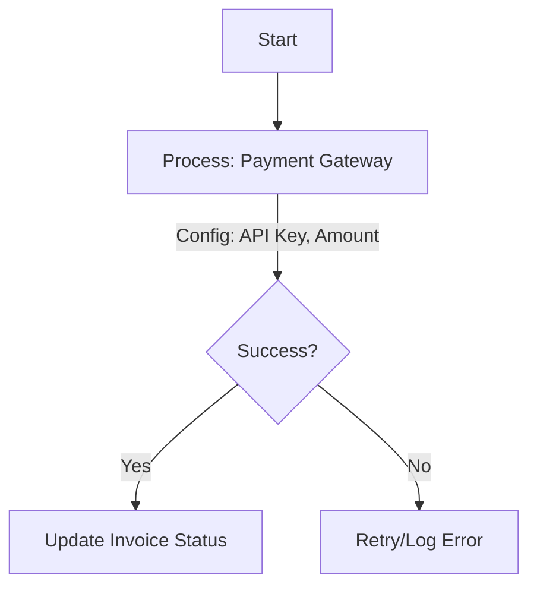
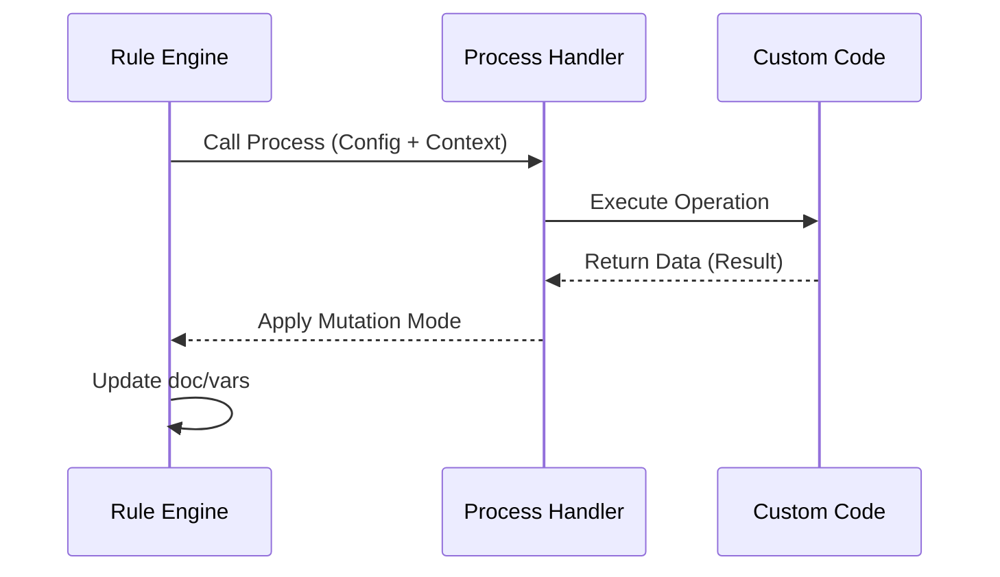

# Process Action

Keywords: process, python, custom logic, integration, extensibility

## Audience

- Developers
- Administrators

## Overview

The **Process** action is the primary way to extend FlexiRule with custom Python code. It executes reusable business logic defined in a `Process` DocType, allowing you to bridge the gap between visual orchestration and complex backend code.

### When to Use
- Use this when you need to perform complex calculations that exceed the capabilities of the Formula Resolver.
- Use this to integrate with external APIs or third-party services.
- Use this to encapsulate common business logic that needs to be reused across many different rules.

### Do Not Use
- Do not use this for simple field updates that can be handled by an [Assignment]() action.
- Do not use this for basic branching logic (use [Condition]() or [Switch]() instead).

---

## Visual Example

---

## Configuration

- **Process**: Select the target Process DocType.
- **Operation**: Choose the specific function within that Process to execute.
- **Config**: Provide inputs as defined by the operation's `config_schema`.

### Execution Flow Diagram

---

## Mutation Mode

After the Process executes, the Rule Engine applies the result based on the selected **Mutation Mode**:

- `Set Context Variable`: Stores the result in the `vars` dictionary (e.g., `vars.api_response`).
- `Set Doc Field`: Updates a specific field on the primary document.
- `Update Doc Field`: Merges a dictionary result into the document's fields.
- `Batch Database Set`: Directly updates the database for performance (bypasses ORM).

---

## Examples

### Basic Example
**Problem**: Calculate the tax for an order using a custom tax engine.
**Configuration**:
- Process: `TaxCalculator`
- Operation: `calculate_vat`
- Mutation Mode: `Set Context Variable` (target: `vars.vat_amount`)
**Execution**: The `TaxCalculator` process is invoked with the document data.
**Result**: `vars.vat_amount` is populated with the calculated value.

### Real-world Example
**Problem**: Verify a customer's credit score via an external bureau before approving a loan.
**Configuration**:
- Process: `CreditBureauIntegration`
- Operation: `get_score`
- Config: `customer_id: doc.customer`
- Mutation Mode: `Set Context Variable` (target: `vars.credit_score`)
**Execution**: An API call is made to the external bureau.
**Result**: The credit score is available for subsequent [Condition]() nodes.

---

## Common Mistakes

- **Direct Database Commits**: Processes should generally return data and let the Engine handle mutations via Mutation Modes to maintain atomicity and auditability.
- **Missing Error Handling**: Not configuring `on_error` behavior for a process that depends on a potentially unstable external API.
- **Large Payloads**: Passing excessively large data structures between Processes and the Engine, which can impact performance.

---

## Related Topics

- [Process Adapter Standards](./standards.md)
- [Execution Engine]()
- [Assignment Action]()
