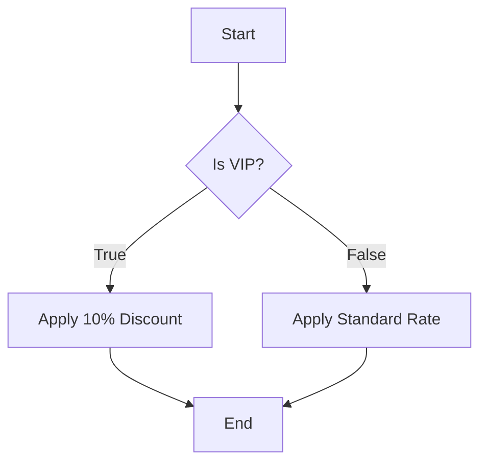
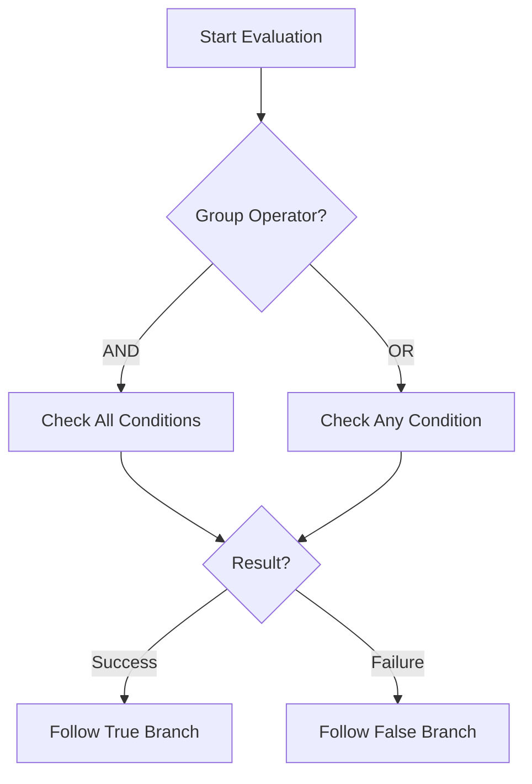

# Condition Action

Keywords: conditions, branching, logic, if-else, evaluation

## Audience

- End Users
- Developers

## Overview

The **Condition** action is the primary mechanism for decision-making within a FlexiRule graph. it evaluates a set of rules against the current execution context and determines which path the execution should take next.

### When to Use
- Use this when you need to branch logic based on field values (e.g., "If Amount > 1000").
- Use this to validate document state before performing an action.
- Use this to check for the existence of specific data in child tables.

### Do Not Use
- Do not use this for simple field mutations (use [Assignment]() instead).
- Do not use this for complex external data lookups (use [Query Records]() or [Process]() instead).

---

## Visual Example

---

## Configuration

Conditions are built using the visual **Condition Builder (V2)**, which supports:

- **Hierarchical Grouping**: Combine conditions using `AND` and `OR` logic.
- **Recursive Collection Logic**: Evaluate child tables or lists using `Any`, `All`, or `None` criteria.
- **Iterator Aliases**: Define custom aliases for nested loop contexts to avoid variable collisions.
- **Drag-and-Drop**: Easily restructure logic by dragging conditions between groups.

### Condition Evaluation Flow

---

## Operator Reference

Each operator evaluates the **Left** value against the **Right** value.

### Equals (`==`)
- **Meaning**: Checks if two values are identical.
- **Syntax**: `left == right`
- **Example**: `doc.status == "Open"`
- **Edge Cases**: Comparing `0` to `False` (evaluates to True in Python).
- **Performance**: High.

### Not Equals (`!=`)
- **Meaning**: Checks if two values are different.
- **Syntax**: `left != right`
- **Example**: `doc.workflow_state != "Approved"`
- **Performance**: High.

### Contains
- **Meaning**: Checks if the Right value exists within the Left collection (String, List, or Table).
- **Syntax**: `right in left`
- **Example**: `"Premium" in doc.customer_tags`
- **Edge Cases**: Case-sensitive by default.
- **Performance**: Medium (scales with collection size).

### Starts With / Ends With
- **Meaning**: Checks string prefixes or suffixes.
- **Syntax**: `left.startswith(right)` / `left.endswith(right)`
- **Example**: `doc.naming_series.startswith("INV-")`
- **Performance**: Medium.

### In / Not In
- **Meaning**: Checks if the Left value exists within a provided list.
- **Syntax**: `left in [val1, val2]`
- **Example**: `doc.category in ["Electronics", "Mobile"]`
- **Performance**: Medium.

### Regex Match
- **Meaning**: Evaluates a regular expression against the value.
- **Syntax**: `re.search(right, left)`
- **Example**: `re.search(r"^[A-Z]{3}-\d{4}$", doc.serial_no)`
- **Performance**: Low (use sparingly).

---

## Examples

### Basic Example
**Problem**: Send a notification only if an Invoice is overdue.
**Configuration**: `doc.status == "Overdue"`
**Execution**: Engine checks the `status` field of the current document.
**Result**: If status is "Overdue", the "True" branch is followed to the Notify action.

### Real-world Example
**Problem**: Auto-approve Sales Orders from "Gold" customers with an amount less than $5,000.
**Configuration**:
- `doc.customer_group == "Gold"`
- `AND`
- `doc.grand_total < 5000`
**Execution**: Both conditions must be met for the True path.
**Result**: The order proceeds to an "Auto-Approve" process action.

### Advanced Example
**Problem**: Check if any item in a Sales Order belongs to the "Electronics" category and has a quantity greater than 10.
**Configuration**: Use **Collection Logic** on `doc.items`:
- `Any` item matches:
    - `item.item_group == "Electronics"`
    - `AND`
    - `item.qty > 10`
**Execution**: The engine iterates through the `items` child table.
**Result**: If at least one row matches, the True branch is triggered.

---

## Common Mistakes

- **Incorrect Data Types**: Comparing a string to a number (e.g., `doc.total == "100"` instead of `100`).
- **Missing Context**: Referencing a variable (`vars.my_var`) that hasn't been set by an upstream action.
- **Over-complication**: Creating deeply nested groups for logic that could be simplified into multiple sequential condition nodes.

---

## Related Topics

- [Condition Builder]()
- [Variables]()
- [Switch Action]()
