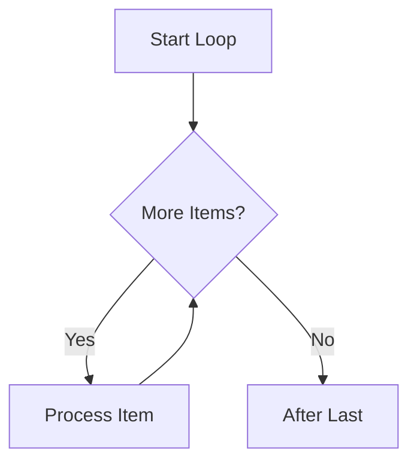

# Loop Action

Keywords: loop, iterate, for-each, collection, child table

## Audience

- End Users
- Developers

## Overview

The **Loop** action enables iterative processing of collections, such as child tables or results from a [Query Records]() action. It allows you to perform a sequence of actions for every item in a list.

### When to Use
- Use this when you need to perform an action for every row in a child table (e.g., validating every item in a Sales Order).
- Use this to process a list of records retrieved from a query.
- Use this to aggregate values manually when the Formula Resolver isn't sufficient.

### Do Not Use
- Do not use this for simple aggregations (like Sum or Count) on child tables if you can use the [Formula Resolver]() in an [Assignment]() action.
- Avoid deeply nested loops for large datasets as they can significantly impact performance.

---

## Visual Example

---

## Configuration

- **Iterator**: A reference to the collection to iterate over (e.g., `doc.items` or `vars.query_results`).
- **Item Alias**: The name to use for the current item inside the loop body (default is `item`).

### Execution Flow

Inside the Rule Builder, the Loop action has two exit ports:
- **For Each**: The path to follow for every item.
- **After Last**: The path to follow once the loop finishes.

---

## Meta Variables

Inside a loop, the engine provides automatic metadata within the `vars.loop` context:

| Variable | Description |
| :--- | :--- |
| `vars.loop.index` | The current iteration number (starts at 0). |
| `vars.loop.length` | The total number of items in the collection. |
| `vars.loop.first` | `True` if it's the first iteration. |
| `vars.loop.last` | `True` if it's the last iteration. |

---

## Examples

### Basic Example
**Problem**: Update the status of every item in a child table.
**Configuration**:
- Iterator: `doc.items`
- Item Alias: `row`
- Loop Body: [Assignment]() node setting `row.status = "Processed"`.
**Execution**: The engine iterates through `doc.items`, setting `row` to each item in turn.
**Result**: Every item in the child table has its status updated.

### Real-world Example
**Problem**: Send a consolidated email after processing all items in a shipment.
**Configuration**:
- Loop over `doc.items`.
- In the **For Each** path: Perform item validation.
- In the **After Last** path: [Notify]() action to send the email.
**Execution**: The engine validates all items, then proceeds to the final notification.
**Result**: One email is sent only after all items are processed.

---

## Common Mistakes

- **Variable Collision**: Using the same `Item Alias` in nested loops. Always use unique aliases for nested contexts (e.g., `parent_item`, `child_item`).
- **Infinite Loops**: Modifying the collection being iterated over (e.g., appending items to `doc.items` while looping over it).
- **Complexity**: Putting too much logic inside the loop body. Consider moving complex loop logic into a [Sub-Rule]() or [Process]().

---

## Related Topics

- [Query Records]()
- [Assignment Action]()
- [Variable Resolution]()
