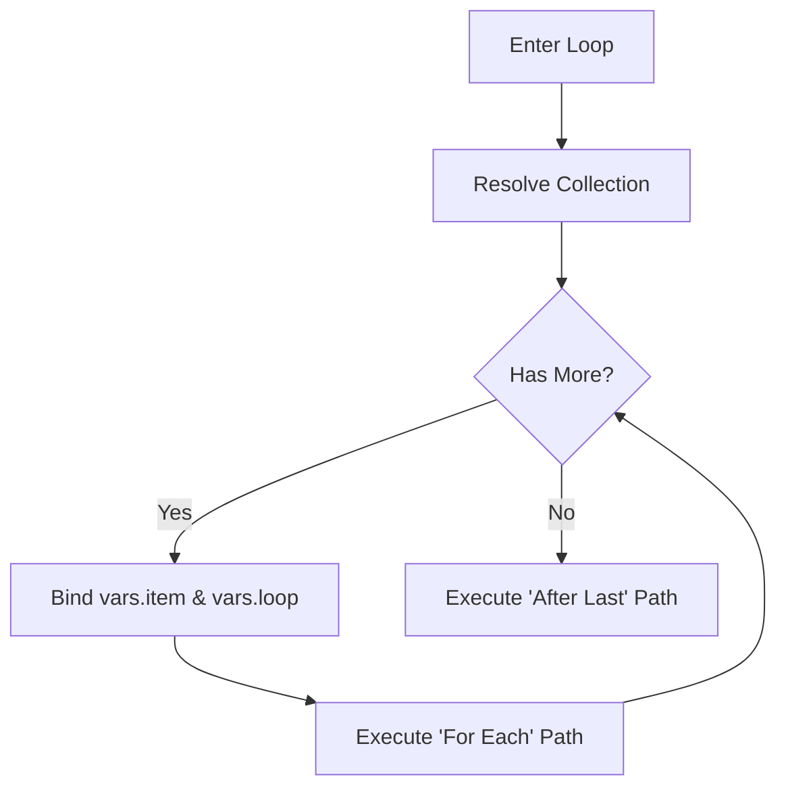

# Loop Action

Keywords: loop, iterate, for-each, collection, child table, repeat

## Overview

The **Loop** action is a flow-control construct that enables iterative processing of collections. It allows rule builders to execute a sequence of actions for every item in a list, such as rows in a child table or records retrieved from a query.

Instead of writing complex scripts to handle batch operations, the Loop action provides a visual way to traverse data structures, making automation logic transparent and maintainable.

## When To Use

- **Child Table Processing**: Validating or updating every item in a Sales Order, Purchase Invoice, or Stock Entry.
- **Batch Record Processing**: Iterating over a list of documents fetched by a [Query Records]() action.
- **Data Transformation**: Mapping values from one collection to another (e.g., creating Task records from Project Milestones).
- **Aggregations**: Performing complex calculations across a collection that cannot be handled by simple formulas.

## Configuration

The Loop action is configured via the properties panel in the Rule Builder.

| Field | Description |
| :--- | :--- |
| **Iterator** | An expression resolving to a list or tuple (e.g., `doc.items` or `vars.search_results`). |
| **Item Alias** | The variable name used to access the current item inside the loop body (defaults to `item`). Note: If the standard **Return Variable** is set, it will take precedence over this field. |
| **Return Variable** | A standard action field that, if configured, serves as the primary iteration variable name. |

### Path Branching
The Loop node features two distinct exit ports:
1.  **For Each**: The execution path followed for every item in the collection.
2.  **After Last**: The execution path followed once the collection has been fully traversed or if the collection is empty.

## Supported Inputs

- **Collection**: A list, tuple, or Frappe child table (e.g., `doc.items`).
- **Context Variables**: Any variable currently available in `vars`.

## Supported Outputs

- **Item Variable**: The current iteration item, bound to `vars[alias]`.
- **Meta Variables**: Automatic iteration metadata available in `vars.loop`.

### Loop Metadata (`vars.loop`)
Inside the loop body, the following variables are automatically managed:

| Variable | Type | Description |
| :--- | :--- | :--- |
| `vars.loop.index` | Integer | The current iteration count (starts at 0). |
| `vars.loop.length` | Integer | The total number of items in the collection. |
| `vars.loop.first` | Boolean | `True` during the first iteration. |
| `vars.loop.last` | Boolean | `True` during the final iteration. |

## Empty Collection Behavior

When the **Iterator** resolves to an empty list or `None`:
- No iteration variables are created.
- The **For Each** branch is skipped.
- Execution continues immediately through the **After Last** branch.

This allows post-processing logic (like summary notifications) to run even when no items are available for processing.

## Execution Behavior

The Loop action operates as a stateful node within the execution graph.

1.  **State Initialization**: The engine initializes internal loop state used to track iteration progress.
2.  **Collection Resolution**: The **Iterator** expression is evaluated against the current context.
3.  **Iteration**: The engine binds the current item and metadata to the context and follows the **For Each** path.
4.  **Completion**: When no items remain, internal bookkeeping is cleaned up, and execution follows the **After Last** path.

## Examples

### Sales Order Line Item Processing
**Problem**: Ensure every item in a Sales Order has a "Delivery Warehouse" assigned before submission.

**Configuration**:
- **Iterator**: `doc.items`
- **Item Alias**: `line`
- **For Each Path**: A [Condition]() node checking if `line.warehouse` is empty, followed by an [Assignment]() or error message.

**Result**: Each line item is validated individually. If a warehouse is missing, the rule can trigger a specific response for that specific line.

### Consolidated Notification after Loop
**Problem**: Process a list of overdue invoices and send a single summary email after all have been flagged.

**Configuration**:
- **Iterator**: `vars.overdue_invoices`
- **Item Alias**: `invoice`
- **For Each Path**: [Assignment]() to update `invoice.status`.
- **After Last Path**: [Notify]() action to send the summary.

**Result**: Invoices are updated one-by-one, but the email is only sent once the entire batch is processed.

## Best Practices

- **Unique Aliases**: When using nested loops, always provide unique **Item Aliases** (e.g., `parent_item`, `child_item`) to avoid variable collision.
- **Minimal Logic**: Keep the logic inside the **For Each** path as lean as possible. If the processing logic is complex, consider moving it into a [Sub-Rule]().
- **Post-Loop Access**: After completion, internal loop bookkeeping is cleaned up, but user-facing variables such as `vars.loop` and the item alias remain available and contain values from the final iteration.
- **Nested Loops**: Each Loop node maintains independent state, allowing parent-child iteration scenarios such as Orders → Items.

## Common Mistakes

- **Modifying the Collection**: Avoid adding or removing items from the collection while iterating over it (e.g., `doc.append("items", ...)` inside a loop over `doc.items`), as this can lead to unpredictable behavior or infinite loops.
- **Deep Nesting**: Avoid nesting loops more than 2-3 levels deep, as this can significantly impact the performance of rule execution.

## Limitations

- **Savepoints**: Loop iterations do not create independent transaction boundaries. Transaction behavior is governed by the parent rule and any nested actions. For details, see [Execution Semantics]().

## Related Topics
- [Execution Semantics]()
- [Architecture Reference]()
- [Query Records]()
- [Assignment]()
