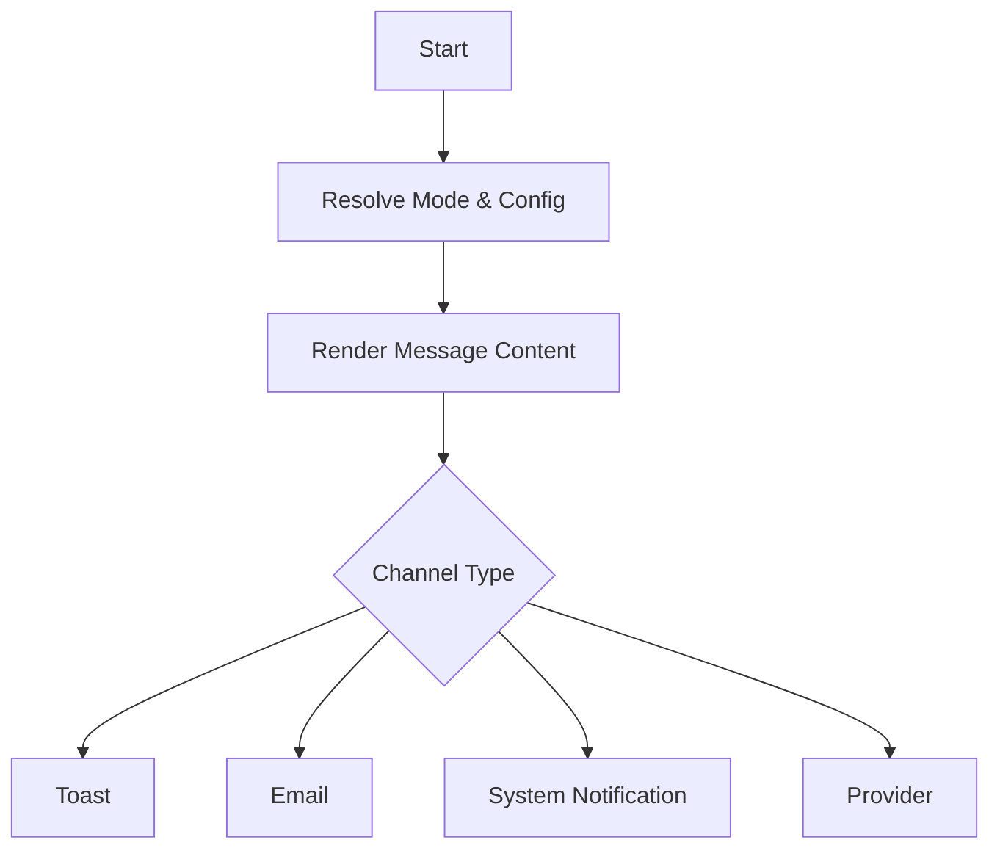

# Notify

Keywords: [notify, email, alert, message, toast, communication, notification]

## Overview
The **Notify** action enables automated communications within your rule flows. It allows rules to interact with users through the Frappe user interface or reach out to external recipients via email and other registered providers. This action is essential for workflows that require human awareness or external system alerts.

## Notification Modes
The Notify action supports several delivery channels. Choose the mode that best fits your communication needs:

| Mode | Best For |
| :--- | :--- |
| [**Toast**]() | Immediate, non-persistent browser alerts for the active user. |
| [**Email**]() | Official communications, documents, and external stakeholder alerts. |
| [**System Notification**]() | Persistent, in-app notifications in the user's Notification Log. |
| [**Provider**]() | Integration with third-party services like SMS, Slack, or WhatsApp. |

## When To Use
- **Immediate Feedback**: Use **Toast** notifications to provide instant feedback to a user during a form action.
- **Workflow Notifications**: Use **System Notifications** to alert users of pending tasks or completed background processes.
- **Automated Emails**: Use **Email** to send documents, confirmations, or reminders to stakeholders.
- **External Alerts**: Use **Provider** to integrate with external services like SMS or custom communication platforms.

## Execution Behavior
When triggered, the Notify action resolves the target channel and renders the message content using the provided templates and current context. The message is then dispatched to the appropriate delivery subsystem.

## Best Practices
- **Use Contextual Data**: Always include document identifiers (like names or IDs) in notifications to provide context.
- **Mind the Volume**: Avoid over-notifying users with frequent Toast messages for non-critical events.
- **Async Execution**: Prefer background rules for sending emails to ensure the UI remains responsive.

## Related Topics
- [Execution Semantics]()
- [Architecture Reference]()
