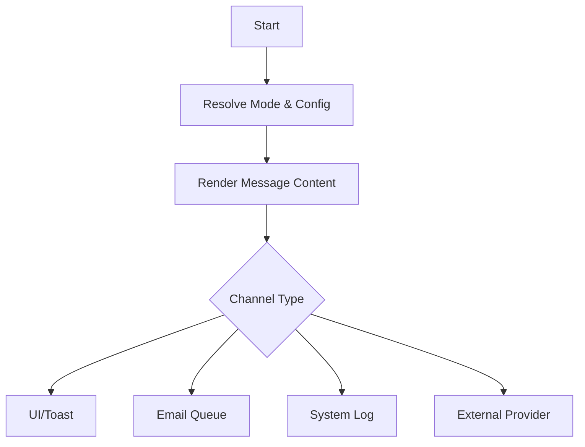

# Notify

Keywords: [notify, email, alert, message, toast, communication, notification]

## Overview
The **Notify** action enables automated communications within your rule flows. It allows rules to interact with users through the Frappe user interface or reach out to external recipients via email and other registered providers. This action is essential for workflows that require human awareness or external system alerts.

## When To Use
- **Immediate Feedback**: Use "Toast" notifications to provide instant feedback to a user during a form action.
- **Workflow Notifications**: Use "System Notifications" to alert users of pending tasks or completed background processes.
- **Automated Emails**: Use "Email" to send documents, confirmations, or reminders to stakeholders.
- **External Alerts**: Use "Provider" to integrate with external services like SMS or custom communication platforms.

## Configuration
The Notify action configuration adapts based on the selected **Notification Type**.

| Field | Description |
| :--- | :--- |
| **Notification Type** | The channel used to deliver the notification (e.g., Email, Toast). |
| **Subject** | The title of the email or system notification. Supports Jinja templates. |
| **Recipients** | The destination addresses for email notifications. |
| **For User** | The specific system user who should receive the notification log. |
| **Provider** | The registered service provider for external notifications. |
| **Recipient** | The provider-specific identifier for the recipient. |
| **Message Builder** | The primary content area for the notification message. Supports Jinja. |
| **Attach Document PDF** | Optionally attach a PDF version of the current record. |

## Supported Inputs
- **Execution Context**: Access to `doc`, `vars`, and system-wide utilities.
- **Jinja Templates**: Dynamic data resolution within Subject, Message, and Recipient fields.

## Supported Outputs
- **Notification Reference**: Returns the rendered message or a reference to the created notification log.

## Execution Behavior
When triggered, the Notify action resolves the target channel and renders the message content using the provided templates and current context. The message is then dispatched to the appropriate delivery subsystem.

## Operators / Features
- **Templating Engine**: Deep integration with Jinja for dynamic message generation.
- **PDF Generation**: Automatic conversion of Frappe documents to PDF attachments for emails.
- **Extensible Providers**: Support for custom notification backends via the Provider architecture.

## Examples

### Payment Reminder
**Problem**: Automatically notify a customer when their invoice is overdue.

**Configuration**:
- **Notification Type**: `Email`
- **Recipients**: `{{ doc.contact_email }}`
- **Subject**: `Overdue Invoice: {{ doc.name }}`
- **Message Builder**: `Dear {{ doc.customer_name }}, invoice {{ doc.name }} is overdue.`
- **Attach Document PDF**: `Yes`

**Result**: An email is queued for the customer with the invoice attached.

### Low Stock Alert
**Problem**: Warn the warehouse manager when an item's stock level is low.

**Configuration**:
- **Notification Type**: `Toast`
- **Message Builder**: `Warning: Stock for {{ doc.item_code }} is below threshold.`

**Result**: A browser alert appears immediately for the active user.

## Best Practices
- **Use Contextual Data**: Always include document identifiers (like names or IDs) in notifications to provide context.
- **Mind the Volume**: Avoid over-notifying users with frequent Toast messages for non-critical events.
- **Async Execution**: Prefer background rules for sending emails to ensure the UI remains responsive.

## Common Mistakes
- **Invalid Variables**: Using field names in Jinja that do not exist in the current document.
- **Missing Recipients**: Failing to ensure the recipient email field is populated.
- **Template Syntax**: Incorrectly formatted Jinja tags that cause rendering failures.

## Limitations
- **Session Dependency**: Toast and System (Realtime) notifications require the recipient to be logged in.
- **Rate Limiting**: Email delivery is subject to the system's email gateway configuration.

## Related Topics
- [Execution Semantics]()
- [Architecture Reference]()
