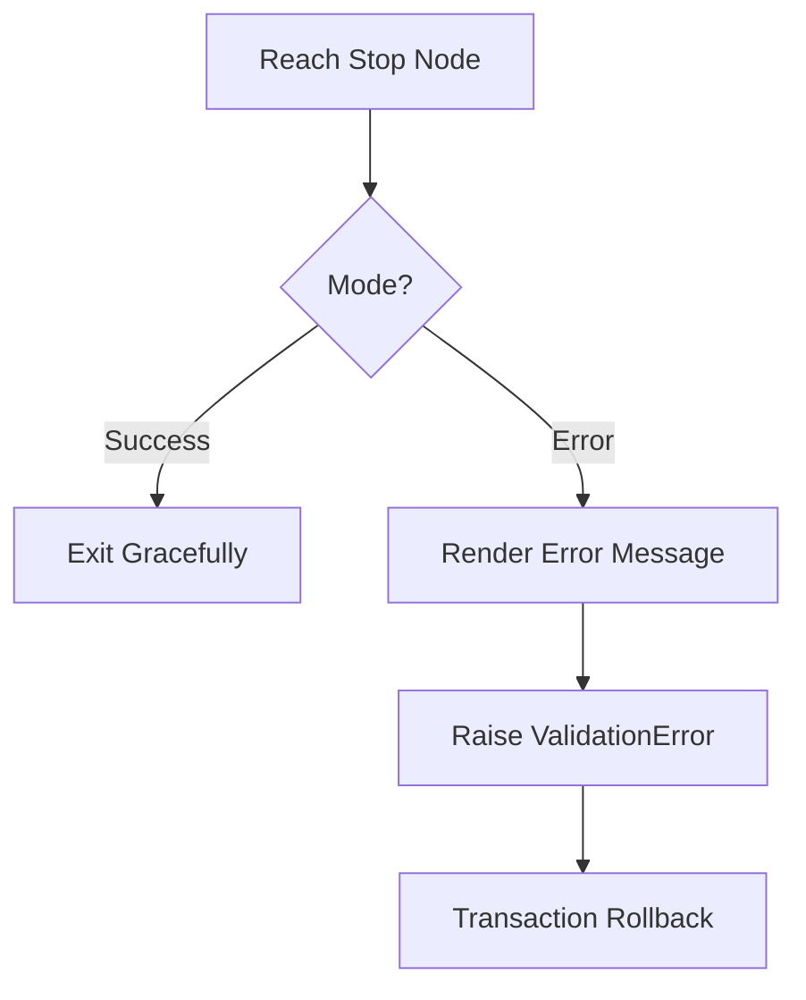

# Stop

Keywords: [stop, terminate, end, exit, finish, error, validation]

## Overview
The **Stop** action is a terminal node used to end the execution of a rule flow. It allows you to specify whether the rule should finish successfully or stop with a validation error that alerts the user.

## When To Use
- **Successful Exit**: End the rule early because no further action is required (e.g., if a document is already in the desired state).
- **Validation Failure**: Block a document from being saved or submitted by raising a user-facing error message.
- **Guard Clauses**: Stop execution at the beginning of a rule if certain preconditions are not met.

## Configuration

| Field | Description |
| :--- | :--- |
| **Termination Mode** | Choose between `Success` (silent exit) or `Error` (raises a validation error). |
| **Error Message** | (Error Mode only) The message displayed to the user. Supports Jinja templates. |

## Supported Inputs
- **`doc`**: Data from the current document can be used to build dynamic error messages.
- **`vars`**: Use calculated values to explain why the rule stopped.

## Supported Outputs
- This action is terminal and does not produce outputs for subsequent nodes.

## Execution Behavior
When the engine reaches a Stop node, it immediately halts processing of the current rule.

- In **Success** mode, the engine stops gracefully.
- In **Error** mode, the engine throws a `frappe.ValidationError`, which rolls back any database changes made during the transaction and displays the rendered error message to the user.

## Operators / Features
- **Jinja Support**: Error messages can be dynamically generated to include specific field values or helpful context.
- **Traceability**: Error messages automatically include a link to the source rule for easier debugging by administrators.

## Examples

### Block Submission for Low Credit
**Problem**: Prevent a Sales Order from being submitted if the customer's credit score is too low.

**Configuration**:
- **Termination Mode**: `Error`
- **Error Message**: `Cannot submit Order {{ doc.name }}. Customer {{ doc.customer }} has a credit score of {{ vars.credit_score }}, which is below the required 600.`

**Result**: The user sees the error message in a red box, and the document is not saved.

### Skip Unnecessary Processing
**Problem**: Stop a rule early if a Support Ticket is already "Closed".

**Configuration**:
- **Termination Mode**: `Success`

**Result**: The rule stops executing without taking any further actions or raising any alerts.

## Best Practices
- **Be Descriptive**: In Error mode, explain *why* the rule stopped and what the user should do next.
- **Use Guard Conditions**: Use a [Condition]() node before a Stop node to only terminate when necessary.

## Common Mistakes
- **Using Success for Errors**: Users won't know why a rule didn't perform an expected action if it exits silently.
- **Circular Errors**: Raising an error in a "Before Save" trigger can sometimes lead to confusing UI states if not handled properly.

## Related Topics
- [Execution Semantics]()
- [Architecture Reference]()
