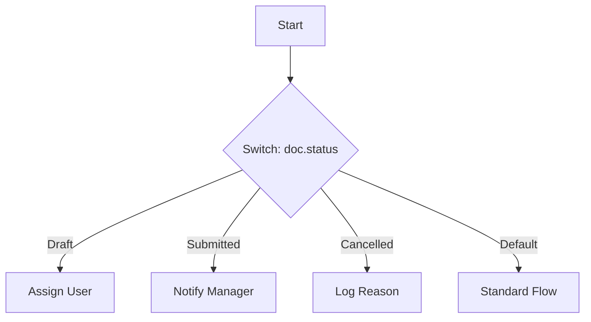

# Switch Action

Keywords: switch, case, branching, routing, multi-path

## Audience

- End Users
- Developers

## Overview

The **Switch** action enables multi-path branching based on the value of an expression. It functions similarly to a `switch` statement in programming, allowing you to route execution to many different paths based on a single variable or field.

### When to Use
- Use this when you have more than two possible paths based on a single field (e.g., "Status" can be New, Open, Closed, or Pending).
- Use this to simplify logic that would otherwise require multiple nested [Condition]() nodes.

### Do Not Use
- Do not use this if you need complex boolean logic (use [Condition]() instead).
- Do not use this if you only have two paths (True/False).

---

## Visual Example

---

## Configuration

- **Expression**: A Python expression that evaluates to a value (e.g., `doc.status`).
- **Cases**: A list of possible values. Each value creates a unique output port in the Rule Builder.
- **Default Path**: The path followed if the expression's result doesn't match any of the defined cases.

---

## Examples

### Basic Example
**Problem**: Route a Support Ticket to different teams based on its priority.
**Configuration**:
- Expression: `doc.priority`
- Cases: `Low`, `Medium`, `High`, `Urgent`
**Execution**: The engine evaluates the priority field and matches it to the corresponding port.
**Result**: Tickets are routed to the appropriate team-specific actions.

### Real-world Example
**Problem**: Apply different discount logic based on a customer's loyalty tier.
**Configuration**:
- Expression: `vars.customer_tier`
- Cases: `Bronze`, `Silver`, `Gold`, `Platinum`
**Execution**: The tier (retrieved earlier in the rule) determines which path is taken.
**Result**: Each tier follows its own specific [Assignment]() logic for discounts.

---

## Common Mistakes

- **Case Sensitivity**: Forgetting that `Gold` and `gold` are different values.
- **Missing Default Path**: Not configuring logic for the Default path, which can lead to unexpected "ends" in the execution flow if an unknown value is encountered.
- **Overlapping Cases**: While the UI prevents identical cases, ensure your expression doesn't resolve to values that are logically ambiguous.

---

## Related Topics

- [Condition Action]()
- [Rule Building]()
- [Variables Reference]()
