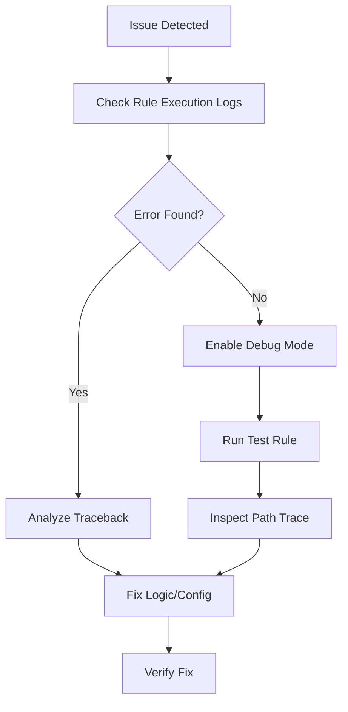

# Troubleshooting

Strategies for identifying and resolving common issues encountered when building or executing rules in FlexiRule.

## Debugging Workflow

Use this systematic approach to isolate and fix problems with your rules.

---

## Common Issues


If a rule fails to trigger when expected, verify the following configuration points:
- **Status**: Is the rule set to **Active**?
- **Trigger Event**: Does the event match the action (e.g., using `Before Save` when the logic depends on values only available `After Save`)?
- **Watched Fields**: If configured, did any of the specified fields actually change during the transaction?
- **Role Permissions**: Is the user triggering the event assigned a role that is listed in **Skip for Roles**?



Errors like `KeyError: 'my_var'` typically indicate the execution engine cannot find a referenced variable.
- **Flow Logic**: Ensure the variable is defined by an **upstream** node in the current execution path.
- **Naming**: Verify the spelling and case-sensitivity of the variable name.
- **Data Model**: If referencing `doc.*`, ensure the field exists on the target DocType.



**Symptom**: "Reentrancy guard blocked execution" error in logs.
- **Cause**: A rule performs a mutation (like `doc.save()`) that triggers the same rule again, creating a loop.
- **Solution**: Add a condition to the entry action to prevent execution if the document is already in the desired state (e.g., `doc.status != "Processed"`).



**Error**: `frappe.exceptions.PermissionError`
- **Solution**: Check if the action requires specific user permissions. You can enable **Ignore Permissions** on individual action nodes if necessary (this requires providing an audit reason).


## Debugging Tools

### Rule Execution Log
The primary diagnostic tool for FlexiRule. It provides a detailed record of each execution:
- **Status**: Clear indication of Success or Failure.
- **Path Trace**: A visual or list-based trace of exactly which nodes were executed.
- **Context Snapshot**: The state of all variables (`vars`) at the time of execution.
- **Error Traceback**: The full Python traceback for failed executions.

### Test Rule (Dry Run)
Available directly within the Rule Builder. This feature allows you to simulate a rule execution against an existing document record without committing any changes to the database.


Always perform a **Test Rule** execution before activating complex logic in a production environment to ensure the path trace matches your expectations.


---

## Related Topics

- [Execution Engine]()
- [Rule Builder]()
- [DocType Reference]()
