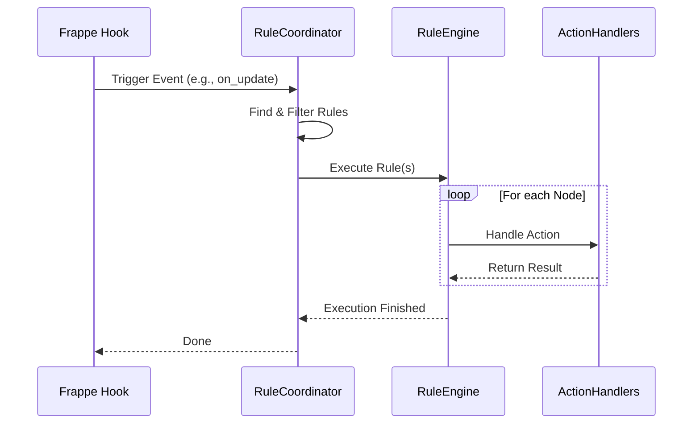
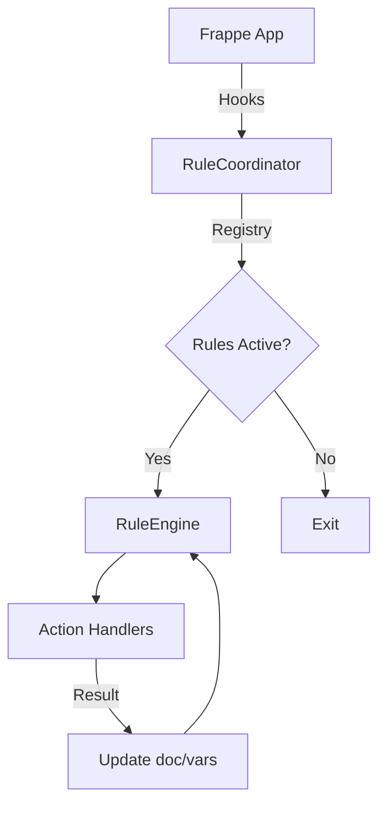

# FlexiRule Architecture

Keywords: architecture, system overview, design, layers, frappe, vueflow

## Audience

- Developers
- Administrators
- Contributors

## Overview

FlexiRule is a visual rule orchestration engine built for Frappe v15+. It bridges the gap between no-code configuration and standard Python business logic by providing a graph-based execution layer.

---

## Rule Execution Lifecycle

---

## System Layers

### 1. Presentation Layer (Frontend)
The frontend is built using **Vue 3** and **VueFlow**, integrated into the Frappe Desk. It manages complex graph states and ensures design-time safety through context-aware validation.

### 2. API Layer
The API layer provides a secure bridge between the frontend and backend. Key functionalities include introspection, validation, and execution testing.

### 3. Domain Layer (Core Engine)
The core engine is responsible for the deterministic execution of rules.
- **RuleCoordinator**: Handles event dispatching and caching.
- **RuleEngine**: Traverses the graph using a Strategy Pattern.
- **ContextManager**: Manages variable scope (`vars`) and mutation modes.

### 4. Persistence Layer (Data Model)
FlexiRule uses several Frappe DocTypes to maintain rules, processes, and audit trails.

---

## Integration Flow

---

## Technical Integrity

The system includes a built-in technical audit mechanism to ensure rule integrity:

- **Graph Validation**: Prevents disconnected nodes, cycles, and invalid exit paths.
- **Contract Enforcement**: Ensures action configurations match backend expectations.
- **Pre-Activation Check**: A full validation suite runs automatically before activation.

---

## Related Topics

- [Execution Engine](../engine/execution_engine/)
- [API Reference](../reference/api/)
- [DocType Reference](../reference/doctypes/)
