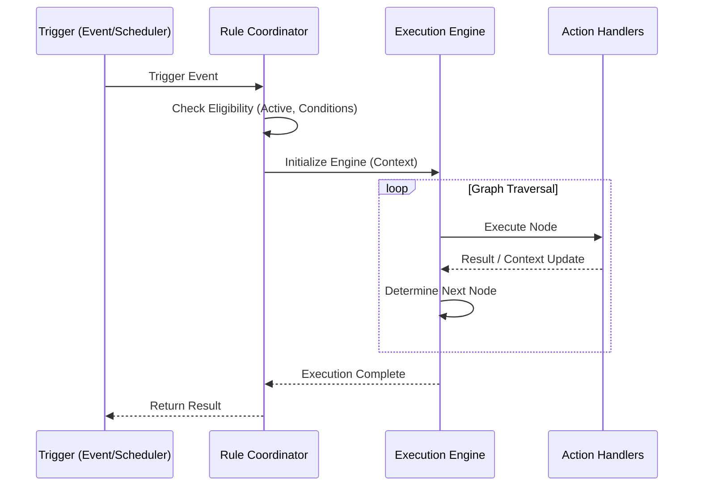
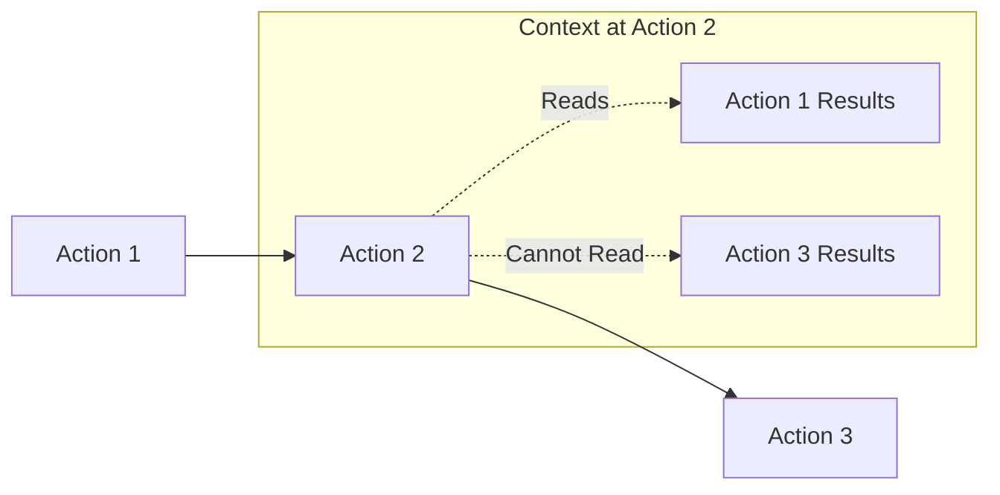

# Execution Engine Deep Dive

Keywords: execution engine, lifecycle, transaction, rollback, reentrancy, sandboxing

## Audience

- Developers
- Administrators

## Overview

The FlexiRule Execution Engine is a deterministic graph executor designed for reliability, observability, and safety. It ensures that business logic is executed in a predictable manner, with built-in protections against common pitfalls like infinite loops and database inconsistency.

---

## Rule Execution Lifecycle

The following diagram illustrates the high-level lifecycle of a rule execution:

---

## Transaction & Error Management

The engine provides enterprise-grade reliability features for handling failures and maintaining data integrity.

### Exponential Backoff Math
When an action is configured with `on_error: "Retry"`, the engine uses an exponential backoff strategy:
- **Delay Formula**: `wait_time = 2 ** current_attempt` seconds.
- **Safety**: Retries are automatically disabled if the context flag `_in_sync_hook` is set, preventing unsafe sleeps in synchronous DocType events.

### Savepoint / Rollback Management
For actions with the `transactional` flag or `on_error: "Rollback"`, the engine uses database savepoints to ensure atomic consistency at the node level.

---

## Reentrancy Guards

To prevent infinite recursive loops, the `RuleCoordinator` implements a global reentrancy guard.

Need to prevent loops?
├── Same Record + Same Event? → **Blocked**
├── Different Record? → **Allowed**
└── Different Event? → **Allowed**

- **Key Format**: `{doctype}:{name}:{event_name}`.
- **Action**: If a key is already present in the local stack, the execution request is denied.

---

## Incremental Context & Isolation

The engine maintains a strict **Temporal Context Isolation** policy.

- **Step-by-Step Availability**: An action can only read variables or document states that have been set by preceding actions.
- **Future Isolation**: An action has no visibility into mutations that occur in subsequent steps.

---

## Safety & Reliability

### Cycle Detection
- **Visit Count**: Each node can be visited a maximum of 100 times.
- **Total Iterations**: A single rule execution is limited to 1000 steps.

### Sandboxing
Rule conditions and templates are evaluated using `SafeFrappeAPI`, preventing unauthorized write operations during evaluation.

---

## Related Topics

- [Rule Building]()
- [Glossary]()
- [API Reference]()
