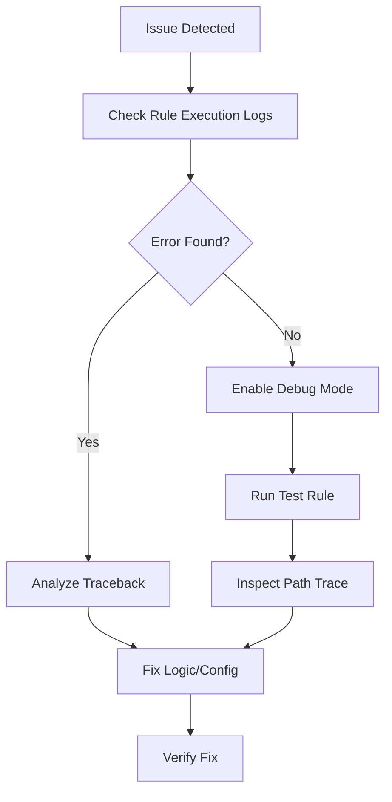

# Troubleshooting

Keywords: troubleshooting, errors, debugging, logs, issues

## Audience

- End Users
- Administrators
- Developers

## Overview

This guide provides strategies for identifying and resolving common issues encountered when building or executing rules in FlexiRule.

---

## Debugging Workflow

---

## Common Issues

### 1. Rule Not Triggering
- **Check**: Is the rule status set to `Active`?
- **Check**: Does the `Trigger Event` match the action being performed (e.g., `Before Save` vs `After Save`)?
- **Check**: Are there `Watched Fields` configured that didn't change?
- **Check**: Does the user triggering the event have a role listed in `Skip for Roles`?

### 2. Variable Resolution Fails
- **Error**: `KeyError: 'my_var'` or `undefined` in template.
- **Check**: Ensure the variable is set by an **upstream** node in the same execution path.
- **Check**: Verify the spelling and case of the variable name.
- **Check**: If using `doc.*`, ensure the field exists on the DocType.

### 3. Infinite Loops (Reentrancy)
- **Symptom**: "Reentrancy guard blocked execution" error in logs.
- **Cause**: A rule is performing a mutation that triggers the same rule again.
- **Fix**: Add a condition to the entry action to prevent execution if the field is already set to the target value (e.g., `doc.status != "Processed"`).

### 4. Permission Denied
- **Error**: `frappe.exceptions.PermissionError`
- **Fix**: Check if the action requires specific permissions. You can enable `Ignore Permissions` on individual action nodes if necessary (requires an audit reason).

---

## Tools for Debugging

### Rule Execution Log
The first place to look. It contains:
- **Status**: Success or Failure.
- **Path Trace**: Exactly which nodes were executed.
- **Context Snapshot**: The state of all `vars` at the time of execution.
- **Error Traceback**: The full Python error if the execution failed.

### Test Rule (Dry Run)
Located in the Rule Builder. Allows you to run the rule against an existing document without committing changes.

---

## Related Topics

- [Execution Engine](../../engine/execution_engine/)
- [Rule Builder](../../builder/rule_builder/#testing--debugging)
- [DocType Reference](../../reference/doctypes/#5-rule-execution-log)
