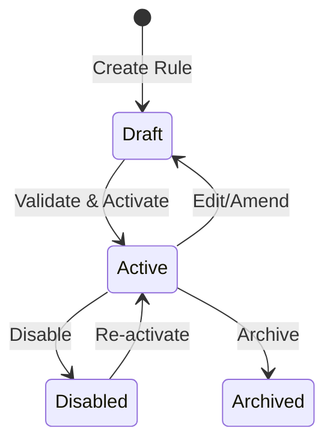

# Visual Rule Builder

Keywords: rule builder, visual editor, drag and drop, workflow, no-code, vueflow

## Audience

- End Users
- Developers

## Overview

The Rule Builder is a Vue 3-based visual workspace for designing business logic graphs. It provides a drag-and-drop canvas where you can orchestrate complex workflows without writing code, while maintaining full visibility into the execution flow.

### When to Use
- Use this to design new business rules and processes.
- Use this to visualize the logical flow of an existing rule.
- Use this to test and debug rules using real document data.

---

## Visual Example

### Dark Theme Support

---

## Key Concepts

### Nodes (Actions)
Each node in the graph represents a **Rule Action**.

- **Entry Action**: The starting point of the graph.
- **Functional Nodes**: Perform work (e.g., [Process](), [Assignment]()).
- **Control Nodes**: Manage flow (e.g., [Condition](), [Loop]()).

---

## The Action Zone

The **Action Zone** is the primary interface for adding new logic to your rule canvas. It provides a streamlined, searchable menu of all available actions, categorized by their function.



### How it works
1. **Trigger**: Hover over any connection point or empty space on the canvas.
2. **Select**: Choose from categorized groups like Data Operations, Control Flow, or Notifications.
3. **Insert**: The new node is automatically inserted and connected, maintaining the logical flow of your rule.

This new UI entry point simplifies the workflow creation process by reducing the number of clicks required to build complex logic chains.

---

## No-Code & Error Prevention

### Temporal Context Visibility
The builder ensures that an action can only access variables that are logically available at its point in the execution flow.

- **Upstream-Only Visibility**: The field picker *only* displays variables created by upstream nodes.
- **Dynamic Schema Switching**: Automatically switches field pickers based on the DocType context.

### Reactive & Type-Aware Controls
- **Intelligent Filter Builder**: Adapts operators based on field types.
- **Magic Formula Builder**: Guided UI for complex logic (Date math, Aggregations).

### Canvas Features

#### Node Interaction & Editing


#### Intelligent Reconnection


#### Bulk Actions


#### Layout Options
The canvas supports multiple layout orientations to suit different rule complexities.

---

## Rule Lifecycle

---

## Examples

### Basic Example
**Problem**: Create a simple rule that sets a field.
**Configuration**:
1. Add an **Entry Action**.
2. Connect it to an **Assignment** action.
3. Configure the Assignment to set `doc.status = "Open"`.
**Result**: When the rule triggers, the status is updated.

### Real-world Example
**Problem**: Complex approval workflow with notifications.
**Configuration**:
1. **Entry**: On Sales Order Submit.
2. **Condition**: Is Total > 10,000?
3. **True Path**: Send **Email** to Manager and set `doc.workflow_state = "Pending Manager"`.
4. **False Path**: Set `doc.workflow_state = "Approved"`.
**Result**: Automated routing based on order value.

---

## Debugging and Testing

The Rule Builder includes built-in tools to test and debug your rules in real-time.

### Interactive Debugging
The debugger allows you to select a sample document and simulate execution.

### Visual Execution Path
Once a test is run, the builder highlights the exact path taken during execution, providing immediate feedback on which nodes were visited.



### Real-Time Results
You can inspect the result of each node, including return values and modified variables, directly on the canvas.

---

## Mobile Responsiveness

FlexiRule is designed with a "mobile-first" mindset for rule management. Users can seamlessly review and edit rules on the go using their mobile devices.

### Key Mobile Features
- **Adaptive UI**: The Rule Builder canvas and configuration panels adjust to smaller screen sizes.
- **On-the-go Editing**: Quickly edit action labels, review conditions, and make urgent tweaks to logic from your smartphone or tablet.
- **Touch-Friendly Controls**: Large, accessible buttons and touch-optimized drag-and-drop interactions.

---

## Related Topics

- [Condition Builder]()
- [Execution Engine]()
- [Action Zone]()
