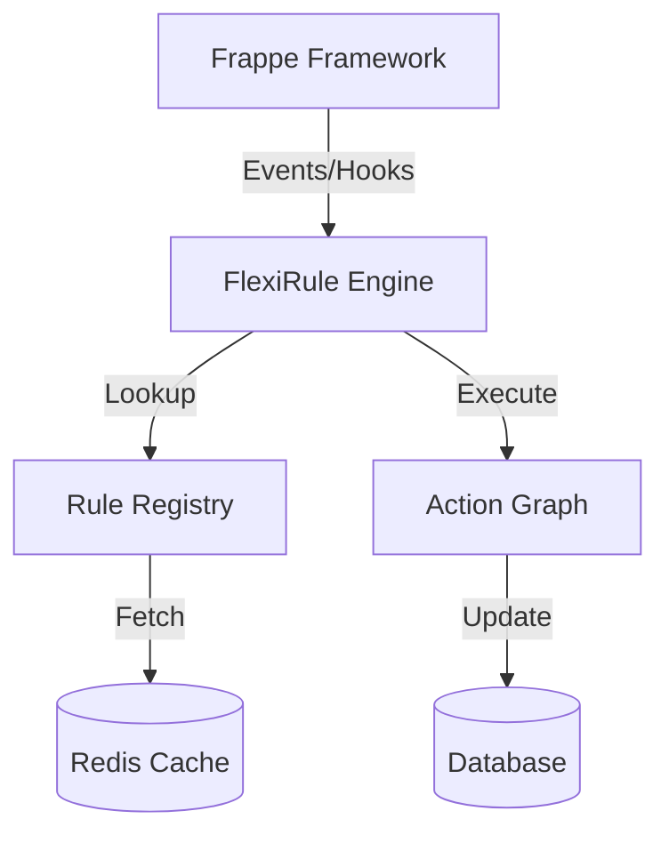

# What is FlexiRule?

FlexiRule is a **Visual Rule Engineer & Orchestration Engine** for Frappe apps and ERPNext. It provides a visual, graph-based orchestration layer that allows you to design executable business logic visually—with full control, observability, and safety.

In modern enterprise systems like Frappe / ERPNext, business logic often evolves into a fragmented web of Python hooks scattered across multiple custom apps. This technical debt leads to "hook-hell," where execution order is implicit, debugging is a nightmare, and upgrades are risky. FlexiRule changes this paradigm.

# Why should I use FlexiRule?

FlexiRule provides several key advantages:

- **Centralized Logic**: Move rules out of scattered `.py` files into a single, auditable dashboard.
- **No-Code Configuration**: Custom UI controls (pickers, autocomplete) allow complex logic setup without a single line of code.
- **Explicit Execution**: Connections define deterministic paths. No more guessing which hook runs first.
- **Schema-Driven UI**: Configuration forms for custom logic are auto-generated from JSON schemas.

# Does ERPNext need FlexiRule?

While ERPNext is powerful, managing complex customizations can become difficult as your business grows. FlexiRule complements ERPNext by:

1.  **Simplifying Customizations**: Reducing the need for complex Python hooks.
2.  **Improving Maintainability**: Making it easier to see and change business logic.
3.  **Enhancing Visibility**: Providing a clear, visual representation of business processes.

# Do I need FlexiRule?

If you find yourself:
- Struggling to manage numerous Server Scripts or Python hooks.
- Needing to change business logic frequently without wanting to deploy code.
- Wanting better visibility into why a certain action happened in your system.
- Looking for a way to empower functional consultants to build automations.

Then **Yes**, FlexiRule is for you.

# Why is FlexiRule a better solution than hard-coded customizations?

| Feature | Hard-coded (Hooks/Scripts) | FlexiRule |
| :--- | :--- | :--- |
| **Visibility** | Hidden in code files | Visual graph |
| **Accessibility** | Developer only | Business Analyst / Admin |
| **Execution Order** | Implicit / Fragile | Explicit / Deterministic |
| **Maintenance** | High effort | Low effort |
| **Auditability** | Difficult | Built-in logging |

# How does FlexiRule achieve high performance?

FlexiRule is built with performance as a core requirement:

- **Condition Compilation**: Visual conditions are pre-compiled into ultra-fast, single-pass pure Python strings on Save.
- **Layered Caching**: A multi-level registry system (Request-local → Redis → DB) ensures lightning-fast rule lookups.
- **Optimized Watched Fields**: Rules only trigger when relevant fields change, reducing unnecessary overhead.
- **Non-blocking Logging**: Execution traces are enqueued asynchronously to prevent slowing down the main transaction.

# Core Concepts

FlexiRule is built around three core pillars:

1.  **The Rule (The Entry Point)**: Defines *when* logic should trigger (DocType events, Scheduler, or Callable).
2.  **The Rule Action (The Node)**: Each step in the graph (e.g., Condition, Assignment, Notify).
3.  **Process & Operations (The Logic)**: Reusable, file-backed logic modules that can be configured via the UI.

# High-level Architecture

FlexiRule sits as an orchestration layer on top of Frappe:

# Key Capabilities

- **Vue 3 Visual Builder**: Modern, reactive interface for building rules.
- **Cycle Detection**: Prevents infinite loops natively.
- **Deterministic Execution**: Zero ambiguity in the execution path.
- **Safe Execution**: Sandboxed environment with automatic rollbacks on failure.
- **Async Processing**: Ability to offload tasks to background workers.
