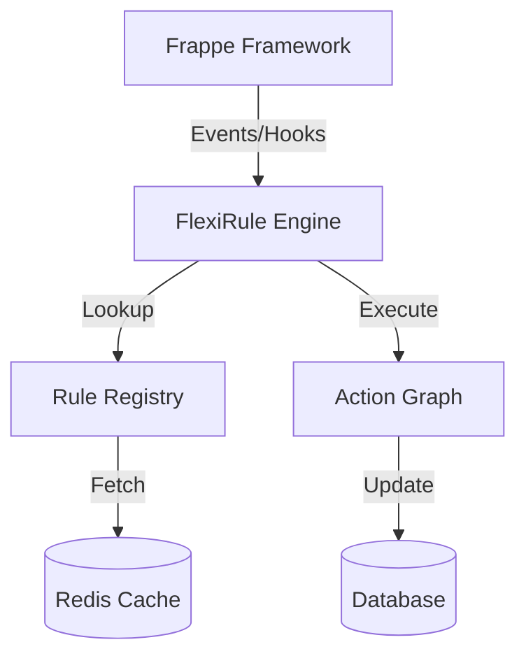

# High-level Architecture

FlexiRule is built as a modular orchestration layer that integrates deeply with the Frappe Framework. It balances a high-performance backend execution engine with a modern, reactive visual interface.

## System Stack

FlexiRule sits between the user actions and the database, coordinating how logic is processed.

## Core Components

### 1. Rule Builder (Frontend)
A Vue 3-based visual interface for designing rules. It provides a drag-and-drop canvas, reactive property panels, and real-time schema validation.

### 2. Backend Engine (The Orchestrator)
The Python-based core that manages rule execution. It handles:
-   **Eligibility Checking**: Verifying if a rule should run (is active, meets conditions).
-   **Context Management**: Handling the state of `doc` and `vars`.
-   **Graph Traversal**: Walking the path of blocks.

### 3. Registry & Contracts
To ensure consistency, FlexiRule uses a **Registry System**. Every block (Action Type) has a defined **Contract** that specifies:
-   What inputs it requires.
-   What outputs it provides.
-   How it should be rendered in the UI.

### 4. Execution Pipeline
The lifecycle of a single rule trigger:
1.  **Intercept**: The `RuleCoordinator` catches a DocType event.
2.  **Filter**: Pre-compiled conditions are checked.
3.  **Plan**: The engine builds an execution plan from the visual graph.
4.  **Execute**: Action Handlers process each block sequentially.
5.  **Log**: The result is enqueued for asynchronous logging.

## Extensibility
FlexiRule is designed to be extended by developers. You can create custom **Action Types** or **Processes** and register them with the engine, making them instantly available to business users in the Visual Builder.
