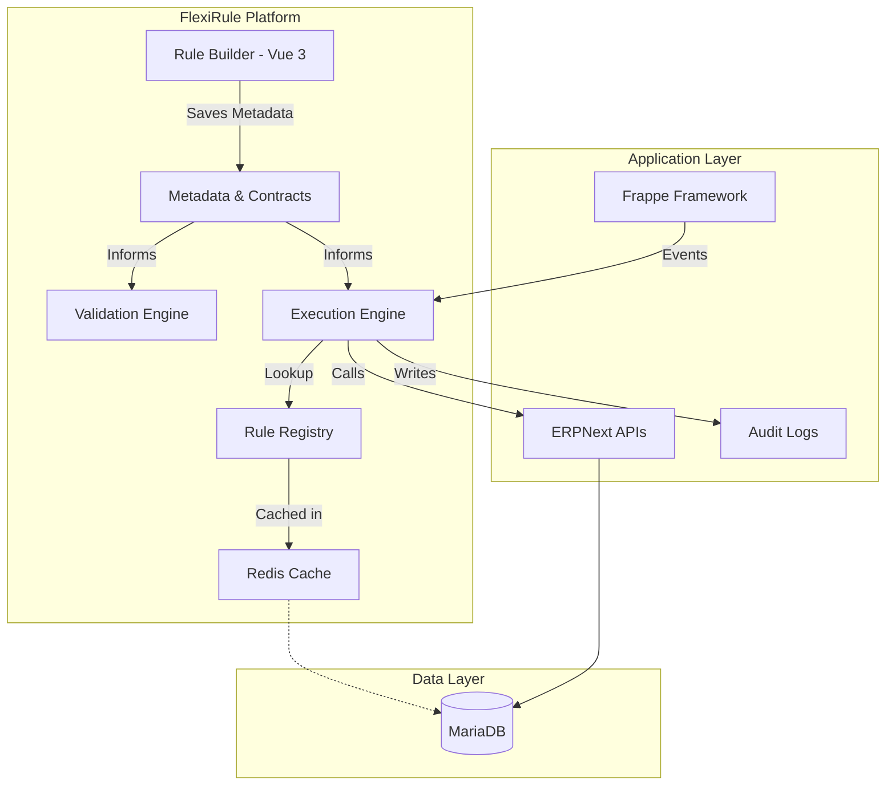

# High-level Architecture

FlexiRule is built around a **contract-driven, metadata-first architecture**. Rather than hard-coding automation into scattered Python modules, business logic is represented as structured metadata. The visual designer, validation engine, and runtime executor all consume the same centralized contracts, ensuring the system remains consistent, extensible, and high-performance.

---

## System Overview

FlexiRule sits as an orchestration layer on top of the Frappe Framework, coordinating how events from ERPNext are transformed into executable business logic.

---

## Core Components

### 1. Registry & Contracts (`flexirule/ruleflow/core/contracts.py`)
This is the single source of truth. Every Action Type (e.g., "Assignment", "Condition", "Query Records") publishes a contract.
- **Why this matters:** The Rule Builder uses these contracts to dynamically generate UI forms, while the Engine uses them to validate execution.
- **Implementation**: See `ActionType` DocType and `action_type_registry.py`.

### 2. The Engine (`flexirule/ruleflow/core/engine.py`)
The engine is the heart of FlexiRule. It handles:
- **Discovery**: Identifying which rules to run based on the event.
- **Orchestration**: Walking the execution graph.
- **Context Management**: Managing the lifecycle of `doc`, `old_doc`, and `vars`.

### 3. Execution Context (`flexirule/ruleflow/core/context_manager.py`)
A sandboxed environment where the rule runs. It ensures that variables (`vars`) are isolated and that document mutations (`doc`) follow Frappe's security model.

### 4. Rule Builder (`flexirule/public/js/flexirule/rule_builder/`)
A Vue 3-based visual designer. It isn't just a drawing tool; it's a **schema-aware editor** that understands the requirements of every logic block in real-time.

---

## Design-Time vs. Runtime

FlexiRule maintains a strict boundary between designing and running rules.

| Phase | Responsibilities | Output |
| :--- | :--- | :--- |
| **Design Time** | Visual Building, Integrity Validation, Condition Compilation. | A **Compiled Execution Plan** stored as JSON. |
| **Runtime** | Event Interception, Registry Lookup, Plan Execution, Auditing. | **State Mutation** and an **Audit Trail**. |

---

## Extension Architecture

Developers can add new capabilities by creating **Action Handlers**.
- **Action Handler**: A Python class (e.g., `AssignmentHandler`) that implements the logic for a specific node type.
- **Registry**: New handlers are registered automatically, making them immediately available in the UI.

---

## Integration Boundaries

- **Inbound**: FlexiRule hooks into DocType events (`before_save`, `on_update`, etc.) via `hooks.py`.
- **Outbound**: Actions interact with Frappe through standard `frappe.get_doc`, `frappe.db`, and other core APIs.
- **Persistence**: Rules, Logs, and Settings are all standard Frappe DocTypes.
