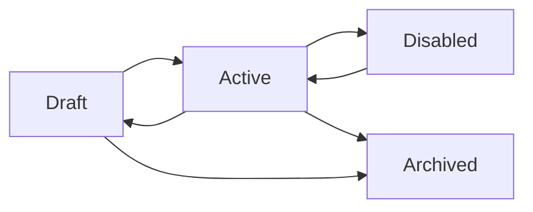

# Rule Lifecycle & Execution

Every automation you build in FlexiRule follows a specific lifecycle. Understanding these stages ensures that you can develop, test, and update your business logic safely without disrupting your live operations.

## Rule States

A rule can be in one of four primary states. You can see the current state in the **Status** badge at the top of the rule page.

| State | Eligible to Run | Editable | Description |
| :--- | :---: | :---: | :--- |
| **Draft** | No | **Yes** | The initial state for all new rules. Use this for building and testing. |
| **Active** | **Yes** | No | The rule is live and will run automatically when its trigger occurs. |
| **Disabled** | No | **Yes** | A previously active rule that has been temporarily turned off. |
| **Archived** | No | No | A retired rule kept only for historical records and old execution logs. |

---

## Managing Your Rules

### 1. Activating a Rule
When your logic is ready for production, click the **Activate** button.
- **Validation**: FlexiRule will automatically check your logic for errors (like missing connections or incomplete configurations).
- **Locking**: Once active, the rule is **locked**. This prevents accidental changes to live business logic.

### 2. Updating an Active Rule (Amending)
If you need to change a rule that is already live, use the **Amend Rule** button.
- **Safety First**: FlexiRule creates a new **Draft** version of your rule.
- **Continuous Operation**: The original version stays **Active** and continues to run your business until you are ready to replace it with the new version.
- **History**: This creates a clear version history, allowing you to see how your logic has evolved over time.

### 3. Disabling a Rule
If you need to stop an automation temporarily without deleting it, you can set it to **Disabled**. This is useful during system maintenance or when a specific business policy is paused.

---

## How a Rule Runs

When a business event occurs (like a Sales Order being saved), FlexiRule follows a specific sequence to decide if and how to run your rules.

### Step 1: Finding the Rule
The system looks for all **Active** rules that match the document type and the event.

### Step 2: Priority Sorting
If multiple rules match the same event, they are run in order of their [Priority]().
- **Priority 20** (High) runs before **Priority 0** (Default).
- This is important if one rule depends on a value set by another rule.

### Step 3: The "Gatekeeper" (Trigger Condition)
Before loading the full logic flow, FlexiRule evaluates the **Trigger Condition** (if you defined one).
- **Example**: "Only run if `Total Amount` is greater than `1000`."
- If the condition is not met, the rule stops immediately without using system resources.

### Step 4: Starting the Flow
Execution always begins at the **Start** (Entry Action) block. From there, it follows the lines you've drawn to the next blocks.

### Step 5: Branching Logic
When the flow reaches a [Check Block](), it evaluates your criteria:
- If the result is **True**, it follows the path marked "True".
- If the result is **False**, it follows the path marked "False".

### Step 6: Completion
The rule finishes when it reaches a **Stop** block or a path with no further connections.


**Execution Safety**: To prevent accidental infinite loops, FlexiRule will automatically stop any rule that tries to execute more than **1,000 steps** in a single run.


---

## Real-World Example: Order Approval
**Scenario**: Automatically approve Sales Orders over $1,000 for VIP customers.

1.  **Trigger**: `Before Save` of a `Sales Order`.
2.  **Trigger Condition**: `doc.grand_total > 1000`.
3.  **Check Block**: Is the customer a "VIP"?
    - **True Path**: Use an **Assignment** block to set `status` to "Approved".
    - **False Path**: Use a **Notify** block to alert the Manager for manual review.

---

## Good to Know

- **Test Before You Activate**: Always use the **Debug Rule** button to run a simulation with real data. It's safer than testing on live orders!
- **Priorities Matter**: If you have two rules—one that calculates a discount and one that sends an email with the total—make sure the discount rule has a higher priority so the email shows the correct final price.
- **Check the Logs**: If an automation didn't run, the [Execution Log]() will tell you exactly why (e.g., "Trigger Condition failed").

---

## Testing & Troubleshooting

### Debug Rule Simulation
Before activating a rule, use the **Debug Rule** tool.
- You can pick a real document from your system and "simulate" the rule.
- You will see exactly which path the logic took and what values were calculated.
- **Important**: Debugging is a simulation; it does not change any real data in your database.

### Execution Logs
Every time an **Active** rule runs, it creates a record in the **Execution Log**.
- You can see the **Visual Path Trace**—a highlighted view of exactly which blocks were executed during that specific run.
- Access these logs from the **Rule Execution Log** list or the dashboard on the Rule page.

---

## Related Topics
- [Adding & Managing Blocks]()
- [Using the "Check" Block]()
- [Working with Variables]()
- [Testing with the Debugger]()
